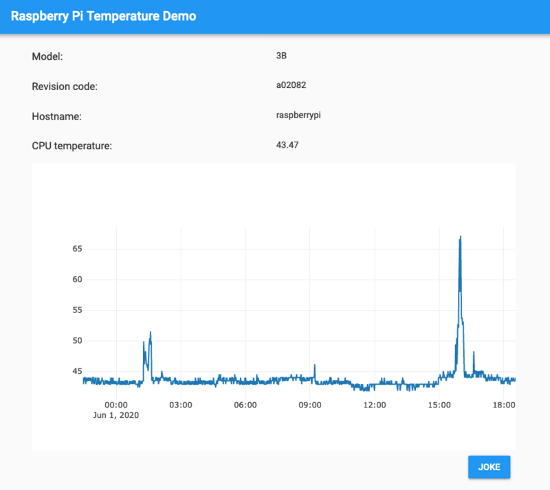

[Last time](https://tooling.bennuttall.com/build-a-custom-google-map-webapp-with-anvil/), I did a
video tutorial introducing Anvil, a web-based tool for building web apps. Today I have a new video
in which I build a new app in Anvil, and then deploy it to be hosted on a Raspberry Pi, to make use
of some Raspberry Pi specific features.

This app features a grid of information about the Pi (model, revision code, etc), shows a graph of
the Pi's CPU temperature, and includes a "joke" button which tells you a joke (using
[pyjokes](https://pyjok.es/)):

<figure class="wp-block-image">

</figure>

Click through to the [video](https://www.youtube.com/watch?v=2B7tWrW5XkA) and you'll see chapter
markings along the way.

<figure class="wp-block-image">
<iframe width="560" height="315" src="https://www.youtube.com/embed/2B7tWrW5XkA?si=GWY8LNiw34A8q8cp" title="YouTube video player" frameborder="0" allow="accelerometer; autoplay; clipboard-write; encrypted-media; gyroscope; picture-in-picture; web-share" referrerpolicy="strict-origin-when-cross-origin" allowfullscreen></iframe>
</figure>

This wasn't possible until very recently, when [Anvil open-sourced their
runtime](https://anvil.works/blog/open-source). This means that you can build your app in Anvil the
usual way, but self-host it if you want to. It's easy to set up on something like an Ubuntu server
or Raspberry Pi. You can even build your app without touching the Anvil website, you just don't have
the fantastic developer experience they provide. Maybe I'll brave that in a future video, once I've
had some practice!

In the tutorial I actually use several tools I've previously covered in this blog:

- [Anvil](/blog/2020/05/build-a-custom-google-map-webapp-with-anvil/)
- [Mythic Beasts Pi Cloud](/blog/2019/07/mythic-beasts-pi-cloud/)
- [Byobu](/blog/2019/06/byobu/)
- [Ranger](/blog/2019/04/ranger/)
- [SSH](/blog/2019/04/ssh-tricks-and-tips/)

You can clone the Anvil-hosted version in Anvil by [clicking this
link](https://anvil.works/build#clone:VSPXKHLKL3BPYLKX=K3C6MJV6OXLKMSP7LQUWYNAB).

You can clone the Raspberry Pi version on a Raspberry Pi here:
[github.com/bennuttall/anvil-rpi-temp-graph](https://github.com/bennuttall/anvil-rpi-temp-graph)

It occurs to me that this tutorial is very Cambridge-centric. I use [Anvil](https://anvil.works/), a
tool built by a Cambridge-based company; deploy it to a [Raspberry
Pi](https://www.raspberrypi.org/), a computer designed in Cambridge; and it's hosted by
Cambridge-based hosting company [Mythic Beasts](https://www.mythic-beasts.com/)!
