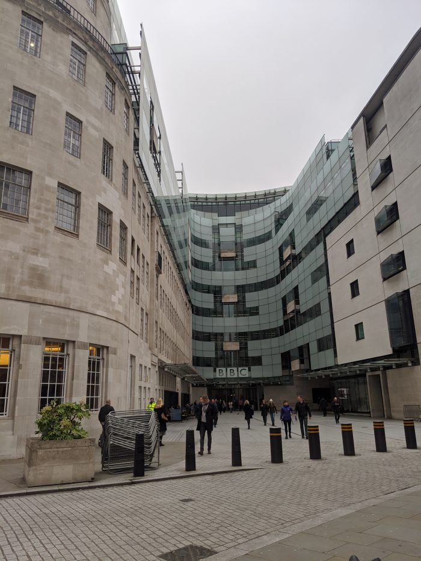

Just a quick note to say I'm leaving the Raspberry Pi Foundation to start a new role at the BBC.
I've been at Raspberry Pi for over six years, and it's been great. I'm excited to join an innovation
team called [BBC News Labs](https://bbcnewslabs.co.uk/). They find new ways to solve problems with
technology, making lives easier for journalists, and they drive innovation within BBC News.

[https://twitter.com/ben_nuttall/status/1214912375918383104](https://twitter.com/ben_nuttall/status/1214912375918383104)

New Labs are based at New Broadcasting House in London, so I'll be partly based there:

<figure class="wp-block-image">

<figcaption>W1A</figcaption>
</figure>

News Labs write up their projects at [bbcnewslabs.co.uk](https://bbcnewslabs.co.uk/) – so read up
there to find out more.

So goodbye Raspberry Pi!

[https://twitter.com/ben_nuttall/status/1220792172993302534](https://twitter.com/ben_nuttall/status/1220792172993302534)

And hello BBC!

[https://twitter.com/ben_nuttall/status/1219941583040188416](https://twitter.com/ben_nuttall/status/1219941583040188416)
