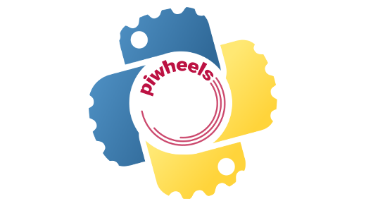

The piwheels project provides pre-compiled Python packages for Raspberry Pi
users, saving them considerable time and effort.

I wrote about piwheels a little over a year ago - I remember Red Hatter [Jeff
Mackanic](https://twitter.com/mackanic) telling me at ATO 2018 how impressed he
was with the project. Back then, piwheels was in its first year, and was already
proving its purpose, but it's come a long way in its second year.

A quick summary (read [this article](/blog/2018/03/speedy-python-package-installation-for-raspberry-pi/)
for a full background) is that piwheels automates building Python wheels
(pre-compiled Python packages) for all the projects on PyPI, the Python Package
Index, using Raspberry Pi hardware to ensure compatibility. This means that when
a Raspberry Pi user wants to install a Python library using **pip**, they get a
ready-made compiled version that's guaranteed to work on the Raspberry Pi. This
saves lots of time and effort, and makes it much easier for Raspberry Pi users
to dive in and get started with their projects.

## How does it work?

[Raspbian](https://www.raspberrypi.org/downloads/raspbian/), the primary OS for
Raspberry Pi, comes pre-configured to use piwheels, so users don't even need to
do anything special to get access to the wheels.

The configuration file (at `/etc/pip.conf`) tells pip to use piwheels.org as an
_additional index_ so pip looks at PyPI first, then piwheels. piwheels.org is
a website hosted on a Raspberry Pi 3. All the wheels built by the project are
hosted on that Pi. It's currently serving over 1 million packages per month.
Not bad for a $35 computer!

As well as that one main Raspberry Pi that serves the website, there are some
others which are used to build the packages. We need some to run Raspbian
Jessie, building wheels for Python 3.4, some with Raspbian Stretch for Python
3.5, and some for Raspbian Buster for Python 3.7. We don't generally support
other Python versions. The total number of builder Pis is 7. There's also a
"proper server" - a VM running the postgres database. The Pi 3 only has 1GB RAM
so the (very large) database doesn't run well, so we had to move it from a Pi to
a VM. The Pi 4 with 4GB RAM would probably be suitable - so we may move to this
in future.

The Pis are all on an IPv6-only network in a "Pi Cloud" - a brilliant service
provided by Cambridge-based hosting company [Mythic Beasts](https://www.mythic-beasts.com/order/rpi).

## Downloads and trends

Every time a wheel file is downloaded, this is logged in the database. Therefore
we get an insight into which packages are most popular, and which Python
versions and operating systems people are using. We don't have much information
from the user agent, but because the architecture of Pi 1/Zero shows as "armv6"
and Pi 2/3/4 show as "armv7", we can tell those apart.

To date (mid-December 2019), over 14 million packages have been downloaded from
piwheels. Nearly 9 million of those were in 2019 alone.

The ten most popular packages of all time are:

1. [pycparser](https://www.piwheels.org/project/pycparser) (821,060)
2. [PyYAML](https://www.piwheels.org/project/PyYAML) (366,979)
3. [numpy](https://www.piwheels.org/project/numpy) (354,531)
4. [cffi](https://www.piwheels.org/project/cffi) (336,982)
5. [MarkupSafe](https://www.piwheels.org/project/MarkupSafe) (318,878)
6. [future](https://www.piwheels.org/project/future) (282,349)
7. [aiohttp](https://www.piwheels.org/project/aiohttp) (277,046)
8. [cryptography](https://www.piwheels.org/project/cryptography) (276,167)
9. [home-assistant-frontend](https://www.piwheels.org/project/home-assistant-frontend) (266,667)
10. [multidict](https://www.piwheels.org/project/multidict) (256,185)

Note that many pure-Python packages such as [urllib3](https://piwheels.org/project/urllib3/)
are provided as wheels on PyPI, which are compatible cross-platform, so they're
not usually downloaded from piwheels, because PyPI takes precedence.

We also see trends in things like usage of Python versions over time. Here you
can see the quick takeover of Python 3.7 from 3.5 when Raspbian Buster was
released:

See more trends in our [stats blog posts](https://blog.piwheels.org/tag/stats/).

## Time saved

Every package build is logged in the database, and every download is also
stored. Cross-referencing downloads with build duration shows how much time has
been saved. One example is numpy, the latest version of which took about 11
minutes to build.

So far, piwheels has saved users a total of over 165 years of build time. At the
current rate, piwheels saves **over 200 days per day**.

As well as the pure saving of build time, having pre-compiled wheels also means
you don't have to install various development tools to be able to build packages.
Some packages require you to have other apt packages available in order for them
to access shared libraries. Figuring out which ones you need can be a pain, so
we wanted to make that step easier too. First of all, we figured out the process
and documented it on our blog:
[How to work out the missing dependencies for a Python package](https://blog.piwheels.org/how-to-work-out-the-missing-dependencies-for-a-python-package/).
Then we added this logic to the build process, so that when a wheel is built,
its dependencies are automatically calculated, and added to the package's
project page:

## What next for piwheels?

The project pages (e.g. [numpy](https://www.piwheels.org/project/numpy/))
launched this year were a really useful way to let people look up information
about a project, in a human readable way. It also makes it easier for people to
report issues, for example if a project is missing from piwheels, or they have
an issue with a package they've downloaded.

In the early new year we're planning to roll out some upgrades to piwheels which
will enable a new JSON API, so you can automatically check which versions we
have, or look up the dependencies for a project, and lots more.

The next Debian/Raspbian upgrade isn't for another 18 months, so we won't start
building wheels for any new Python versions until then.

You can read more about piwheels on the project's [blog](https://blog.piwheels.org/).
I'll be publishing a 2019 round-up in early January. You can also follow
[@piwheels](https://twitter.com/piwheels) on Twitter, where you'll see daily and
monthly stats, along with any milestones reached.

Of course, piwheels is an open source project. You can see the entire project
source code on GitHub: [https://github.com/piwheels/](https://github.com/piwheels/)
