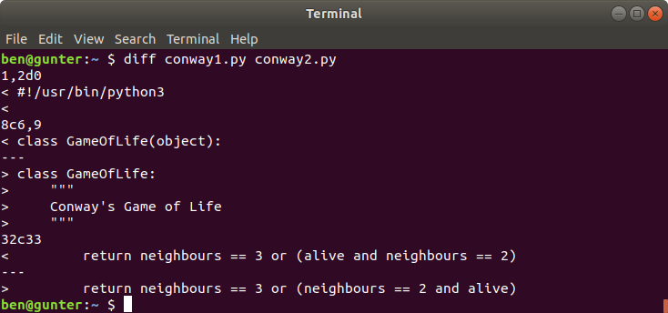
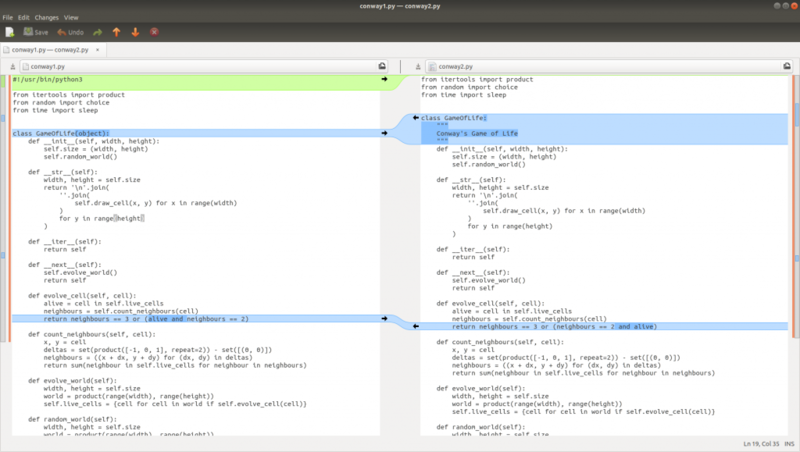
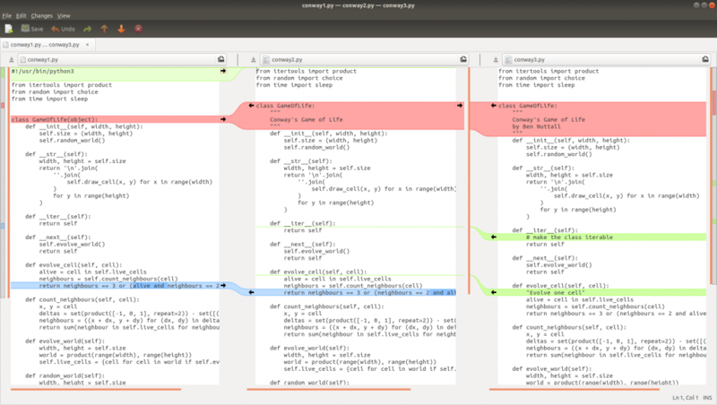
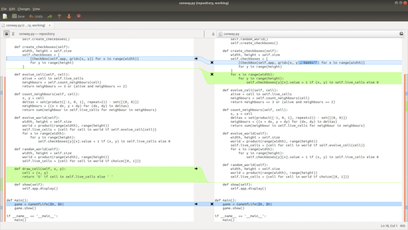
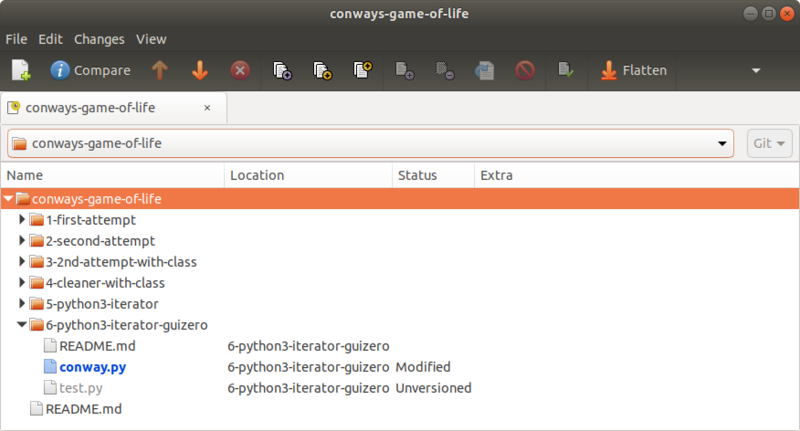
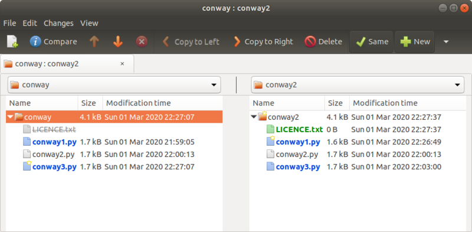

One of my essential tools for working with code and data files is [meld](https://meldmerge.org/).
It's a graphical diff tool, so if you've ever used **diff** and struggled to make sense of the
output, **meld** is here to help.

<figure class="wp-block-image">

</figure>

This is a brilliant description from the project's website:

> Meld is a visual diff and merge tool developers. Meld helps you compare files, directories, and
> version controlled projects. It provides two- and three-way comparison of both files and
> directories, and has support for many popular version control systems.
>
> Meld helps you review code changes and understand patches. It might even help you to figure out
> what is going on in that merge you keep avoiding.
>
> [meldmerge.org](https://meldmerge.org/)

You can install meld on Debian/Ubuntu systems (including Raspbian) with:

```
sudo apt install meld
```

It's cross-platform – there's a Windows download and it's available for Mac with brew.

If you had two similar files (perhaps one is a modified version of the other) and wanted to see the
changes between them, you could run the `diff` command on them to see the difference in the
terminal:

<figure class="wp-block-image">

</figure>

This example shows the differences between `conway1.py` and `conway2.py`:

- Removed the shbang and second line
- Removed `(object)` from the class declaration
- Added a docstring to the class
- Swapped the order of `alive` and `neighbours == 2` in a method

The same example using **meld**:

```
meld conway1.py conway2.py
```

<figure class="wp-block-image">

</figure>

Much clearer!

You can easily see the changes, and you can easily merge changes between files by clicking the
arrows (these work both ways). And you can even edit the files live (meld doubles up as a simple
text editor too – with live comparisons as you type) – just be sure to save before you close the
window.

You can even compare and edit three different files:

<figure class="wp-block-image">

</figure>

Hopefully, you're using a version control system like **git**. If so, your changes aren't between
two different files, but differences between the current working file, and the one known by git.
meld understands this and if you run `meld conway.py` where `conway.py` is known by git, it'll show
you any changes made since the last git commit:

<figure class="wp-block-image">

</figure>

Here you can see changes made in the current version (on the right) and the repository version
(left). You can see I deleted a method, added a parameter and a loop since the last commit.

If you run `meld .` you'll see all the changes in the directory (or the whole repository if you're
in the root of it):

<figure class="wp-block-image">

</figure>

Here you can see a single file modified, another file unversioned (that means it's new to git so I
need to git add the file) and lots of others unmodified. There are various display options provided
by icons along the top.

You can also compare two directories which is sometimes handy too:

<figure class="wp-block-image">

</figure>
