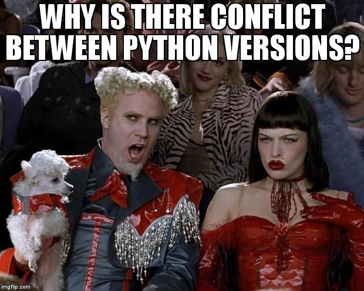

A few months ago I was looking through questions posted to the [Raspberry Pi Stack Exchange
site](https://raspberrypi.stackexchange.com/). If you're not familiar, [Stack
Exchange](https://stackexchange.com/) provides Q&A sites like Stack Overflow for specific areas,
such as particular programming languages, technologies or other topics. And while observing the
erratic nature of the way people post questions to the site, I thought "wouldn't it be funny to take
questions from Stack Exchange and put them on meme templates?" and it seemed like a trivial enough
task to automate, so I started googling things, and typing stuff into a Python shell, and within an
hour or so I had it working. The results were random and hilarious, as I expected.

<figure class="wp-block-gallery columns-3 is-cropped wp-block-gallery-4 is-layout-flex wp-block-gallery-is-layout-flex"><ul class="blocks-gallery-grid"><li class="blocks-gallery-item"><figure></figure></li><li class="blocks-gallery-item"><figure></figure></li><li class="blocks-gallery-item"><figure></figure></li><li class="blocks-gallery-item"><figure></figure></li></ul><figcaption class="blocks-gallery-caption">First attempts</figcaption></figure>

Sometimes ideas like this seem simple in theory, but in practice there's some complexity you didn't
think of that gets in the way. But with this idea, everything was smooth sailing. I found the [Stack
Exchange API](https://api.stackexchange.com/) easy to use, and came across the
[imgflip](https://imgflip.com/) site, which provides an [API](https://api.imgflip.com/). All I
needed to be able to do was retrieve question titles from a particular Stack Exchange site, and to
add text to a random meme template. Both of these things were trivial, and as I've done a lot of
things using web APIs in Python lately, all the skills were [well
practised](https://en.wikipedia.org/wiki/Kata), which helps a lot.

Once the concept was proven, I decided to set up a Twitter account for the memes. I added code to
tweet the images. Again, this is something I've done a lot of, so no hassle. I forget how long it
took to get the app approved and the bot working, but before long,
[@pi_stack](https://twitter.com/pi_stack/) was tweeting out memes autonomously.

## Hit and miss

Meme templates are chosen randomly, so obviously not every question / meme combination will work.
Some will never be funny, some won't be a good match, some will end up on a template that doesn't
really work. Over time I got to see which meme templates would never work, and blacklisted them. I
also made sure that text was placed in the correct position for most effect: some templates work
better with the text in the second or third position than the first – and as I only have one piece
of text to add, this makes all the difference.

Later I decided to add some logic to choose the right meme template based on simple rules like
"starts with X", or to use a different template if it "doesn't end in Y". This seemed to make a big
difference, though it's still very hit-and-miss.

## The test suite

I decided to create a test suite so I could more confidently make changes to the library without
risking breaking things. Even though this is a silly side project, it's been another way for me to
exercise good practice which makes it easier when you need to do this stuff for real.

In [gpiozero](https://github.com/gpiozero/gpiozero) we have a mock pin interface which allows us to
test the workings of the library without running on real Raspberry Pi hardware. And in the test
suite we use patch to mock behaviour. I had to learn some new techniques for mocking things like web
requests, image uploads and even tweets. I'm sure my methods are far from perfect but it's a decent
attempt with good coverage. Check out the
[tests](https://github.com/bennuttall/meme-overflow/tree/master/tests) and
[coverage](https://codecov.io/github/bennuttall/meme-overflow).

## Instances

I started with the Raspberry Pi Stack Exchange, and later added other instances:

- [@pi_stack](https://twitter.com/pi_stack) (Raspberry Pi)
- [@overflow_meme](https://twitter.com/overflow_meme) (Stack Overflow)
- [@worldbuildingme](https://twitter.com/worldbuildingme) (World Building)
- [@askubuntumemes](https://twitter.com/askubuntumemes) (Ask Ubuntu)
- [@stackamemia](https://twitter.com/stackamemia) (Academia)

If you're not familiar with the concept of "world building", it's for people who are designing
worlds for books, stories, games and such – and have questions like "[What is keeping my Terror Bird
from being the size of a T.
Rex?](https://worldbuilding.stackexchange.com/questions/124928/what-is-keeping-my-terror-bird-from-being-the-size-of-a-t-rex)"
which are perfect for this project.

I've tried to set up more (there are so many great Stack Exchange sites) but Twitter is not letting
me authenticate more accounts with the same mobile number.

## Best in show

Here are some examples that worked well:

<figure class="wp-block-gallery aligncenter columns-3 is-cropped wp-block-gallery-5 is-layout-flex wp-block-gallery-is-layout-flex"><ul class="blocks-gallery-grid"><li class="blocks-gallery-item"><figure></figure></li><li class="blocks-gallery-item"><figure></figure></li><li class="blocks-gallery-item"><figure></figure></li><li class="blocks-gallery-item"><figure></figure></li><li class="blocks-gallery-item"><figure></figure></li><li class="blocks-gallery-item"><figure></figure></li><li class="blocks-gallery-item"><figure></figure></li><li class="blocks-gallery-item"><figure></figure></li><li class="blocks-gallery-item"><figure></figure></li><li class="blocks-gallery-item"><figure></figure></li><li class="blocks-gallery-item"><figure></figure></li><li class="blocks-gallery-item"><figure></figure></li><li class="blocks-gallery-item"><figure></figure></li><li class="blocks-gallery-item"><figure></figure></li><li class="blocks-gallery-item"><figure></figure></li></ul></figure>

One of the best ones ever was extremely unlikely. It was a template that almost never works, because
it really requires two pieces of text to make sense. But in this one case, it was perfect. In the
RPi.GPIO library, Python warnings are switched on by default, and you have to turn them off. Most
people find them annoying and include the line that disables them. The problem with Python warnings
is that they look like errors/exceptions – people see red text and think there's something wrong
with their program – when really it's working fine but it's just letting them know something
unimportant like they've already configured that pin. So someone on Raspberry Pi asked about the
warning message, posting just the warning text (verbatim) as the question title, where the desired
outcome is that no warning is output. And – by chance – this subtle genius comes out of Meme
Overflow:

<figure class="wp-block-image">

</figure>

Another recent one was from World Building. Again, completely random:

<figure class="wp-block-image">

</figure>

## Is anyone following?

The Stack Overflow bot is the most popular, with nearly 500 followers at the time of writing.
Raspberry Pi and Ask Ubuntu have over 100 each.

## Run your own instance

If you want to run your own bot following a particular Stack Exchange site, you can
[`pip install memeoverflow`](https://pypi.org/project/memeoverflow/) and use the example script,
following the [simple guide](https://github.com/bennuttall/meme-overflow/blob/master/README.md).

If you want to run a modified version, you can either [fork the
project](https://github.com/bennuttall/meme-overflow) or subclass the provided class.

<figure class="aligncenter size-large">

<figcaption>Mr President</figcaption>
</figure>

