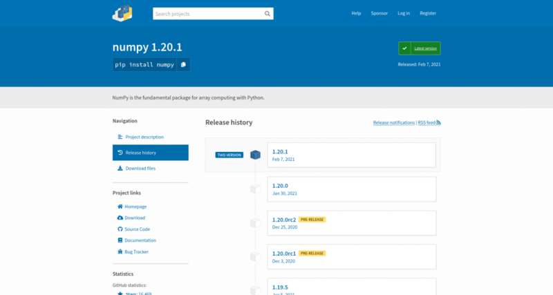
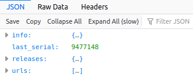
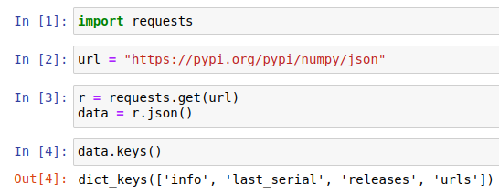
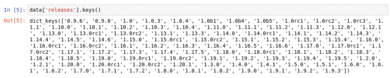
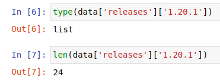
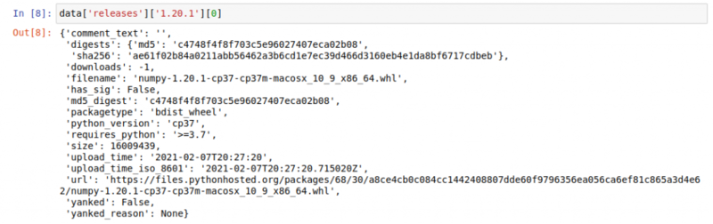
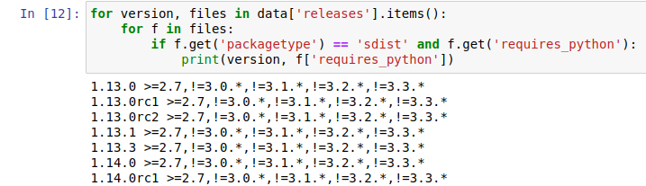
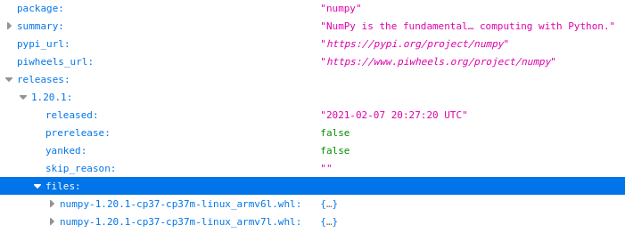
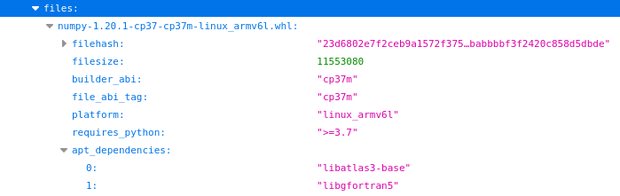

PyPI, the Python package index, provides a JSON API for information about its packages. This is
essentially a machine-readable source of the same kind of data you can access while browsing the
website. For example, as a human, I can head to the numpy project page in my browser, click around
and see which versions there are, what files are available, and things like release dates and which
Python versions are supported:

<figure class="wp-block-image">

</figure>

But if I want to be able to write a program to access this data, I can use the JSON API instead of
having to scrape and parse the HTML on these pages.

Aside: *on the old PyPI website, when it was hosted at **pypi.python.org**, the URL of the numpy
project page was at **pypi.python.org/pypi/numpy** – and accessing the JSON was a simple matter of
adding a **/json** on the end, hence: **https://pypi.org/pypi/numpy/json**. Now the PyPI website is
hosted at **pypi.org** – and numpy's project page is at **pypi.org/project/numpy** – but the new
site doesn't include rendering the JSON – but it's still running as it was before. So now, rather
than adding **/json** to the URL, you have to remember the URL of where they are.*

You can open up the JSON for numpy in your browser by heading to its URL. Firefox renders it nicely
like this:

<figure class="wp-block-image">

</figure>

You can open up `info`, `releases` and `urls` to inspect the contents within. Or you can load it
into a Python shell. Here's a few lines to get started:

```python
import requests
url = "https://pypi.org/pypi/numpy/json"
r = requests.get(url)
data = r.json()
```

Once you have the data (calling `.json()` provides you with a
[dictionary](https://docs.python.org/3/tutorial/datastructures.html#dictionaries) of the data), you
can inspect it:

<figure class="wp-block-image">

</figure>

Open up `releases` and inspect the keys inside it:

<figure class="wp-block-image">

</figure>

This shows that `releases` is a dictionary with version numbers as keys. Pick one (say, the latest
one) and inspect that:

<figure class="wp-block-image">

</figure>

Each release is a list – the one we're looking at contains 24 items. But what is each item? Since
it's a list, we can index the first one and take a look:

<figure class="wp-block-image">

</figure>

This item is a dictionary containing details about a particular file. So each of the 24 items in the
list relates to a file associated with this particular version number – the 24 files you see listed
at **<https://pypi.org/project/numpy/1.20.1/#files>**

Now you could write a script which looks for something within the available data. For example, the
following loop looks for versions which have sdist (source distribution) files that specify a
`requires_python` attribute and prints them out:

```python
for version, files in data['releases'].items():
    for f in files:
        if f.get('packagetype') == 'sdist' and f.get('requires_python'):
            print(version, f['requires_python'])
```

<figure class="wp-block-image">

</figure>

## piwheels

Last year I [implemented a similar
API](https://blog.piwheels.org/requires-python-support-new-project-page-layout-and-a-new-json-api/)
on the piwheels website. [piwheels.org](https://www.piwheels.org/) is a Python package index which
provides wheels (pre-compiled binary packages) for the Raspberry Pi architecture – it's essentially
a mirror of the package set on PyPI, but with Arm wheels instead of any files uploaded to PyPI by
package maintainers.

Since we mimic the URL structure of PyPI, i.e. you can change the `pypi.org` part of the URL of a
project page to `piwheels.org` and it'll show you a similar kind of project page – showing details
about which versions we have built and which files are available. Since I liked the way the old site
allowed you to add **/json** to the end of the URL, I made ours work like this, so numpy's project
page on PyPI is **[pypi.org/project/numpy](https://pypi.org/project/numpy)** – on piwheels is
**[piwheels.org/project/numpy](https://www.piwheels.org/project/numpy)** – and the JSON is at
**[piwheels.org/project/numpy/json](https://www.piwheels.org/project/numpy/json)**

There's no need to duplicate the contents of PyPI's API, only provide information about what's
available on piwheels, so we include a list of all known releases, some basic information and a list
of files we have:

<figure class="wp-block-image size-large">

</figure>

Similarly to the previous PyPI example, you could create a script to analyse the API contents, for
example to show the number of files piwheels has for each version of numpy:

```python
import requests

url = "https://www.piwheels.org/project/numpy/json"
package = requests.get(url).json()

for version, info in package['releases'].items():
    if info['files']:
        print('{}: {} files'.format(version, len(info['files'])))
    else:
        print('{}: No files'.format(version))
```

Also, each file contains some metadata:

<figure class="wp-block-image size-large">

</figure>

One particularly useful thing here is the `apt_dependencies` field which lists the apt packages
needed to be able to use the library. In the case of this numpy file, as well as installing numpy
with pip, you'll also need to install `libatlas3-base` and `libgfortran` using Debian's package
manager `apt`.

Here is an example script which shows the apt dependencies for a package:

```python
import requests

def get_install(package, abi):
    url = 'https://piwheels.org/project/{}/json'.format(package)
    r = requests.get(url)
    data = r.json()
    for version, release in sorted(data['releases'].items(), reverse=True):
        for filename, file in release['files'].items():
            if abi in filename:
                deps = ' '.join(file['apt_dependencies'])
                print("sudo apt install {}".format(deps))
                print("sudo pip3 install {}=={}".format(package, version))
                return

get_install('opencv-python', 'cp37m')
get_install('opencv-python', 'cp35m')
get_install('opencv-python-headless', 'cp37m')
get_install('opencv-python-headless', 'cp35m')
```

We also provide a general API endpoint for the list of packages, which includes download stats for
each package:

```python
import requests

url = "https://www.piwheels.org/packages.json"
packages = requests.get(url).json()
packages = {
    pkg: (d_month, d_all)
    for pkg, d_month, d_all, *_ in packages
}

package = 'numpy'
d_month, d_all = packages[package]

print(package, "has had", d_month, "downloads in the last month")
print(package, "has had", d_all, "downloads in total")
```

## pip search

Since `pip search` is currently disabled due to its XMLRPC interface being overloaded, people have
been looking for alternatives. You can use the piwheels JSON API to search for package names
instead, seeing as the set of packages is the same:

```python
import sys

import requests

PIWHEELS_URL = 'https://www.piwheels.org/packages.json'

r = requests.get(PIWHEELS_URL)
packages = {p[0] for p in r.json()}

def search(term):
    for pkg in packages:
        if term in pkg:
            yield pkg

if __name__ == '__main__':
    if len(sys.argv) == 2:
        results = search(sys.argv[1].lower())
        for res in results:
            print(res)
    else:
        print("Usage: pip_search TERM")
```

More information about the piwheels API can be found here:
[https://www.piwheels.org/json.html](https://www.piwheels.org/json.html)
