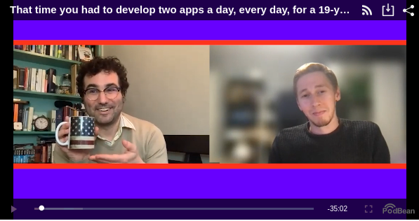

Following the success of my article [*The surreal experience of my first developer
job*](/blog/2021/04/the-surreal-experience-of-my-first-developer-job/), which made it to
the [top](https://news.ycombinator.com/item?id=28058816) of [Hacker
News](https://news.ycombinator.com/) for a whole day, I was invited to tell the story on the
excellent podcast *[Client Horror Stories](https://clienthorrorstories.com/)*. The video is
available on clienthorrorstories.com:

<figure class="wp-block-image">

</figure>

Thanks to [Morgan](https://westegg.com/) for having me on!
