The Jupyter project started out as *IPython* and the *IPython Notebook*. It was originally a
Python-specific interactive shell and notebook environment which later branched out to become
language-agnostic, supporting **Ju**lia, **Pyt**hon and **R** – and potentially anything else.

<figure class="wp-block-image size-large">
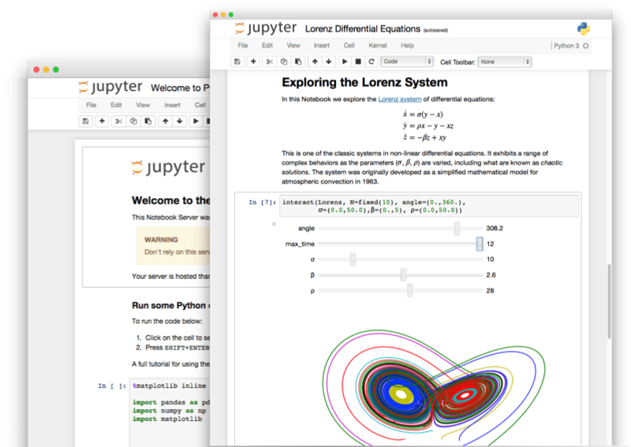
</figure>

IPython is a Python shell – similar to what you get when you type `python` or `python3` at the
command line – but it's more clever and more helpful. If you've ever typed a multi-line command into
the Python shell and wanted to repeat it, you'll understand the frustration of having to scroll
through your history one line at a time. With IPython, you can scroll back through whole blocks at a
time, while still being able to navigate line-by-line and edit parts of those blocks.

<figure class="wp-block-image">
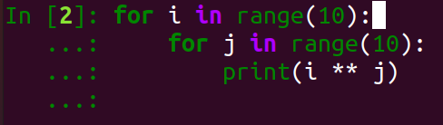
</figure>

It has autocompletion and provides context-aware suggestions:

<figure class="wp-block-image size-large">
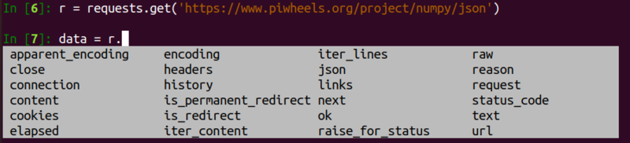
</figure>

It pretty-prints by default:

<figure class="wp-block-image size-large">
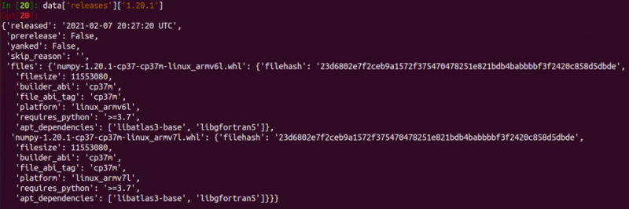
</figure>

It even allows you to run shell commands:

<figure class="wp-block-image">
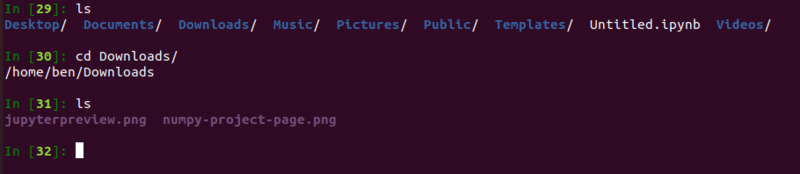
</figure>

It also provides helpful features like adding `?` to an object as a shortcut for running `help()`
without breaking your flow:

<figure class="wp-block-image">
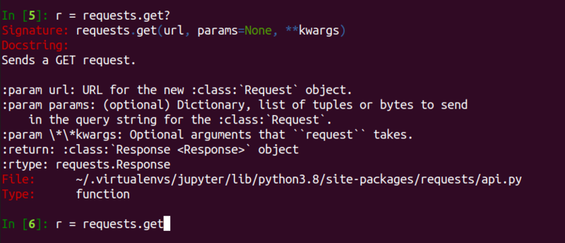
</figure>

If you're using a virtual environment (see my post on
[virtualenvwrapper](/blog/2021/02/virtualenvwrapper/)), install it with pip in the
environment:

```
pip install ipython
```

To install it system-wide, you can use apt on Debian / Ubuntu / Raspberry Pi:

```
sudo apt install ipython3
```

or with pip:

```
sudo pip3 install ipython
```

## Jupyter notebooks

Jupyter notebooks take the IPython shell to the next level. First of all, they're browser-based, not
terminal based. To get started, install `jupyter`

If you're using a virtual environment (see my post on
[virtualenvwrapper](/blog/2021/02/virtualenvwrapper/)), install it with pip in the
environment:

```
pip install jupyter
```

To install it system-wide, you can use apt on Debian / Ubuntu / Raspberry Pi:

```
sudo apt install jupyter-notebook
```

or with pip:

```
sudo pip3 install jupyter
```

Launch the notebook with:

```
jupyter notebook
```

This will open in your browser:

<figure class="wp-block-image size-large">
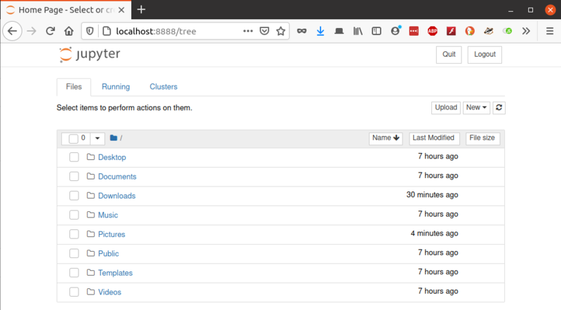
</figure>

You can create a new Python 3 notebook using the **New** dropdown:

<figure class="wp-block-image">
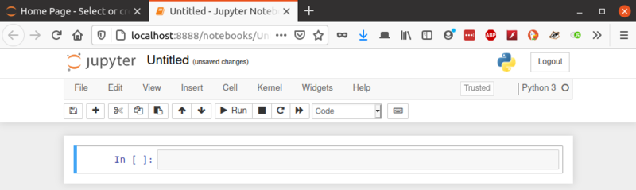
</figure>

Now you can write and execute commands in the `In[ ]` fields. Use **Enter** for a newline within the
block, and **Shift-Enter** to execute:

<figure class="wp-block-image">
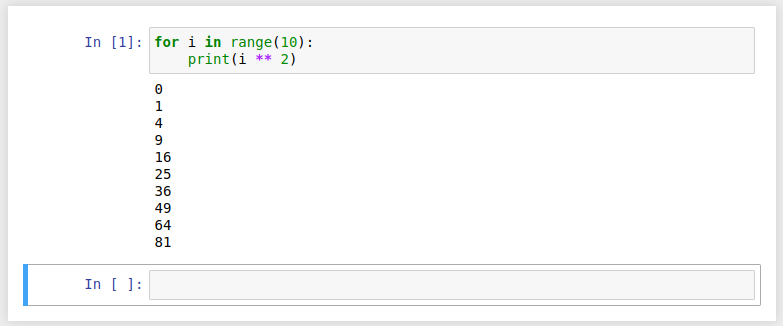
</figure>

You can edit and re-run blocks. You can re-order them, delete them, copy/paste and so on. You can
run blocks in any order – but be aware that any variables creates will be in scope according to the
time of execution, rather than the order they appear within the notebook. You can restart and clear
output or restart and run all blocks from within the **Kernel** menu.

Using the `print` function will output every time. But if you only have a single statement that's
not assigned, or your last statement is unassigned, it will be output anyway:

<figure class="wp-block-image">
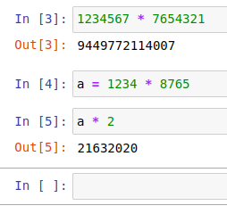
</figure>

You can even refer to `In` and `Out` as indexable objects:

<figure class="wp-block-image">
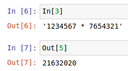
</figure>

All the IPython features are available, and are often presented a little nicer too:

<figure class="wp-block-image">
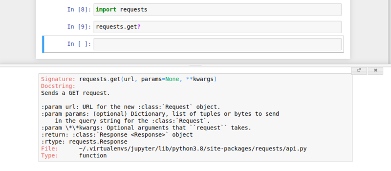
</figure>

You can even do inline plots using matplotlib:

<figure class="wp-block-image">
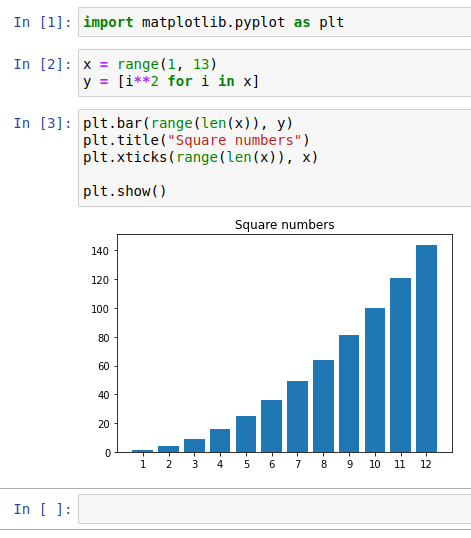
</figure>

Finally, you can save your notebooks, include them in git repositories and if you push to GitHub –
they will render as completed notebooks – outputs, graphs and all:

<figure class="wp-block-image size-large">
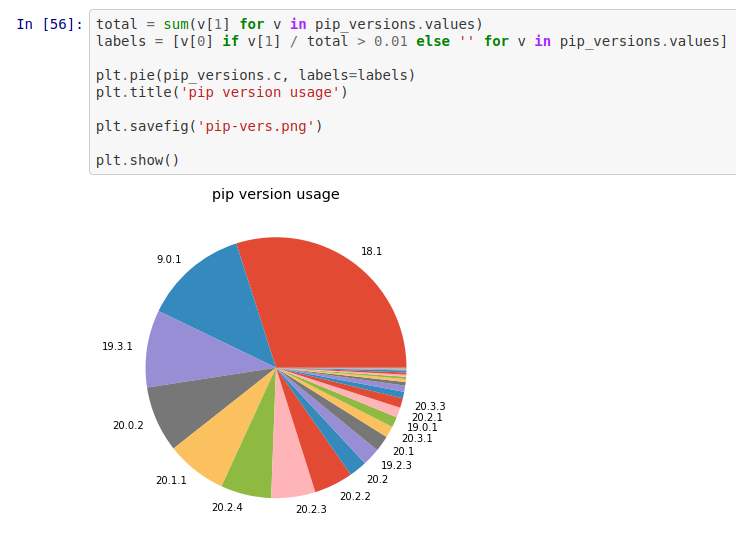
<figcaption><a
href="https://github.com/piwheels/stats/blob/master/2020.ipynb">https://github.com/piwheels/stats/blob/master/2020.ipynb</a></figcaption>
</figure>
