Nearly ten years ago I graduated with a degree in Mathematics & Computing, with a keen interest in
pursuing a career involving maths and programming, but with little idea how. First and foremost I
had decided to stay in Manchester after uni, rather than risk getting stuck at my parents' if I
moved back home. So I rented a flat with a friend from uni and started looking for a job. I had
spent a lot of time at uni learning web development – not so much from the course, but self-taught
as the course was quite far behind. I was happily making websites with the LAMP stack, I felt pretty
capable at it and I knew there were plenty of such jobs in the Manchester area – so I started
applying for "Web developer" and "PHP developer" and similar positions in all sorts of local
companies.

My first interview was with a company called *App Start* in an office building in an old fashioned
industrial estate in a horrible part of Salford (if you think of [Media
City](https://www.mediacityuk.co.uk/) as *Salford*, the rest Salford would be a shock). I was
pushing it for time due to underestimating the walk from the train station, and I arrived a bit
flustered from the rush and trying to find the place. I was greeted by a man in beach shorts and
flip-flops. I was dressed in a full suit, shirt, tie and smart shoes, and I told him "I'm here for
an interview with Chris" – his response "Oh, Chris doesn't work here any more" should have set off
alarm bells, but hey, I was young and naive.

<figure class="aligncenter size-large">
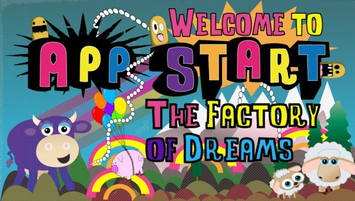
</figure>

<figure class="aligncenter size-large">

<figcaption>Clifton Business Park, Salford. The real factory of dreams.</figcaption>
</figure>

The guy in flip-flops, Alex, seemed to be in charge now. He asked which role I'd applied for – I
said "web developer" and he invited me in. There were about 15-20 people working at desktop PCs.
There was a big sofa. The floor was bare concrete. In between whiteboards with passwords written on
them you could see the walls were graffitied. The "interview" involved him trying to find my CV in
Chris's inbox, and me showing him some websites I'd made. He asked if I could come in the next day,
to do a day's work as a trial – so I did.

The next day was a Friday – and I seem to recall building a prototype of a social networking site –
although I'm not sure why. Anyway – he seemed to think I was good enough so he offered me the job –
starting on Monday – which was great for me – I'd landed a full-time job starting straight away,
meaning I could pay the rent and start my post-uni life in Manchester. But once I accepted, he asked
"are you free tomorrow?" – I hesitated but answered the question – "yes". "Can you come in?" and
because I wasn't sure what else to say, I said yes. Again, this should have been a sign.

The owner was a young entrepreneur called Andrew, who I was told had made millions through his
property development and management company, *Fresh Start Living*. He decided to get into the "app"
market (remember, this was 2011 – iPhone apps were huge) and so he'd decided to give his IT guy
(Alex) a budget to hire some developers to make a load of apps. Surely one of them would be a huge
success and he'd make millions.

## Monday to Friday? 9 to 5?

I went back again on the Saturday to find no sign of anyone in the office. I waited around a bit but
didn't know what to do. I didn't have a contact number for Alex. After a while, he showed up. He'd
been in the Fresh Start Living side of the building. We did a day's work on our own in the office.
He gave me a lift home and I was due to start work for real on the Monday.

I arrived on Monday, and was told about the project I'd be working on. The short version is that I
was told we had to have it finished before anyone could go home. We were there until 9pm. That was
my first day as a full-time employee.

<figure class="aligncenter size-large">
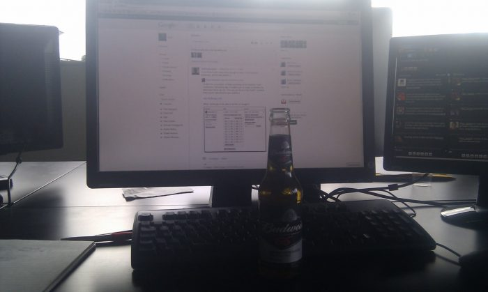
<figcaption>My desk. A desktop PC running Windows. Google+ and the original Tweetdeck.
Beer.</figcaption>
</figure>

## Skill Buy

So on my first day, Alex told me the project I'd be working on was called *Skill Buy*, and proceeded
to explain the concept. The idea was similar to an auction site that was popular at the time where
you could bid on a product, but you paid for every bid – so if you saw an iPhone with a winning bid
of 1p, you could bid 2p, but if you were outbid, you'd lost your 2p – eventually someone would win
it at a bargain price at the expense of everyone who'd bid before them and the company would make a
fortune. They're called penny auctions and you can read about them in this paper: *[**Are online
penny auctions a form of
gambling?**](https://irep.ntu.ac.uk/id/eprint/26656/1/PubSub3120_Griffiths.pdf)* Anyway – the idea
I'd been told about was similar, but instead of bidding, you'd play a game (a *Flash* or *Unity*
game made by the game devs I was working with) – and it worked like an arcade game – the winner gets
the prize. You'd buy credits, spend your credits playing games, and if you were the top scorer at
the end of the game's countdown timer, you'd win the prize. Actually you'd win the prize at 99%
discount because they seemed to think that got around gambling laws.

Without a web developer on staff, getting this idea off the ground had proved tricky, and Alex had
been using his own jack-of-all-trades skills to knock something together. He had some experience
managing an e-commerce site (I later found out that he ran his own online sex toy shop...) so he'd
put together a Skill Buy prototype using the PHP e-commerce framework *Magento*. He would add
products (prizes) in the site's admin area, and hacked away at the templates to show countdown
timers and things. Somehow, Alex had promised the site would be ready to show Andrew the next day –
and at some point in the afternoon he started to stress out and said to the whole room "no-one's
going home until this is done". One of the game devs, had made a target shooting practice game in
*Unity*, and we had to figure out how to embed it in the site and get the game to submit the
player's score to the site's PHP back-end. We had no idea where to start, but we worked on it all
afternoon, well into the evening, and we got it working to whatever standard Alex had required, and
finally got to go home.

<figure class="aligncenter size-large">
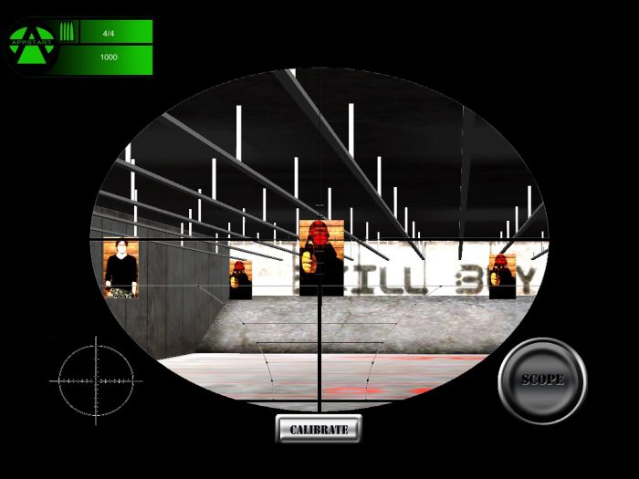
<figcaption>The shooting range game</figcaption>
</figure>

Over the next few weeks I worked on the site, I grew fed up of being stuck in this e-commerce
framework – having to work with its hyper-normalised MySQL database (the [EAV
model](https://en.wikipedia.org/wiki/Entity%E2%80%93attribute%E2%80%93value_model)), and the fact
the product I was building wasn't really a shop – so I asked Alex if he minded me writing something
custom instead. I got my own custom PHP/MySQL site up-and-running pretty quickly, and it didn't take
long before we launched the site. I was happy enough writing crappy PHP, implementing questionable
security protections (feeble attempts to block people from sending in fake scores), and learning
things like how to integrate Facebook Login, PayPal payments, using AJAX, and working with the game
devs to integrate with the scoring system. I actually quite enjoyed working there for a little
while! It was liberating, knowing I was using my self-taught web dev skills on my own terms – and
getting paid to do so.

<figure class="aligncenter size-large">
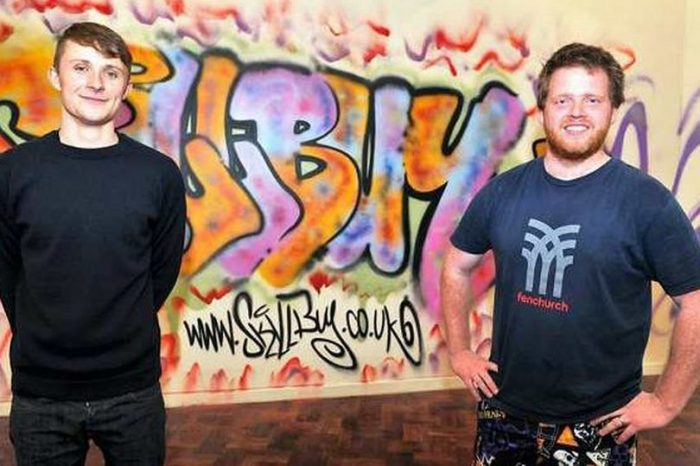
<figcaption>Alex McDaid (beard) and Liam Daly</figcaption>
</figure>

<figure class="aligncenter size-large">
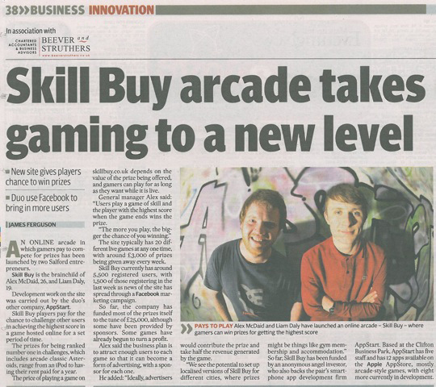
<figcaption>Coverage from the Manchester Evening News, which you can still <a
href="https://www.manchestereveningnews.co.uk/business/innovation/appstart-launches-online-arcade-skill-872914">read
online</a></figcaption>
</figure>

The apps company was being run by Alex and a 19-year-old kid called Liam, whose Uncle was involved
in the property business. Somehow Liam had been given an experimental side-project business to help
run as his "placement year" at uni.

<figure class="aligncenter size-large">
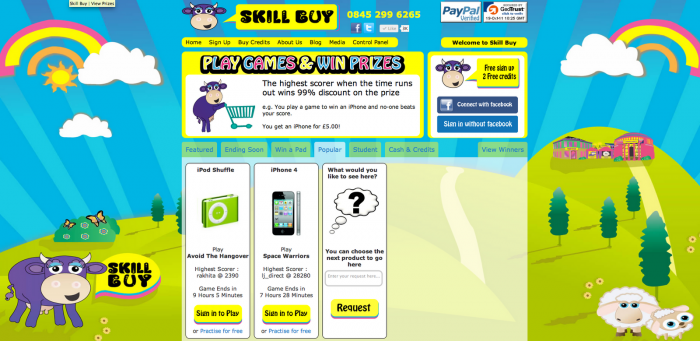
<figcaption>Skill Buy</figcaption>
</figure>

One thing that might strike you as odd is the bizarre graphics. The designer had made all these
cow-in-a-field graphics for an iPhone game that was planned – but they'd shelved it and told her to
re-use them on the website. She *hated* that they were being used like this – and it didn't make
sense to anyone else either.

Alex had a tendency of regularly asking if you were free on Saturday. The first few times I said
yes, and just worked an extra day – I think I assumed I would automatically get paid overtime – but
I didn't. Eventually I just learned to say no.

A little while after I joined, a guy called Bob turned up and took some kind of product manager job,
similar to Alex and Liam. Like Liam, he seemed nice enough but somewhat out of place. He was a
friend of Alex's. He used to stare at Google Analytics all day and come over and tell me things
about bounce times and referrals. He used to leave after lunch, for whatever reason, so he earned
the nickname *Half-a-job Bob.* He didn't last long though. One day, he'd been in a meeting with
Andrew, who'd obviously seen through him and had enough. I came to discover that when Andrew decided
he didn't like someone, rather than fire them, he'd have a go at them and make them feel so angry
they'd want to leave. Bob marched through the door, slammed it behind him, muttering loudly to
himself "he's not talking to me like that" and declared to the room that he was "taking no more of
Andrew's shit" and stormed out.

<figure class="wp-block-gallery columns-3 is-cropped wp-block-gallery-1 is-layout-flex wp-block-gallery-is-layout-flex">
<ul class="blocks-gallery-grid"><li class="blocks-gallery-item"><figure>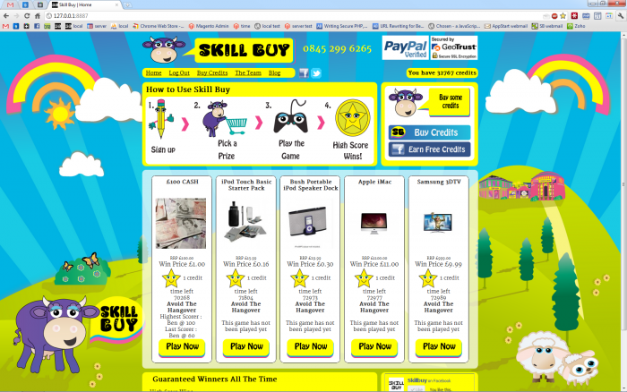</figure></li><li class="blocks-gallery-item"><figure>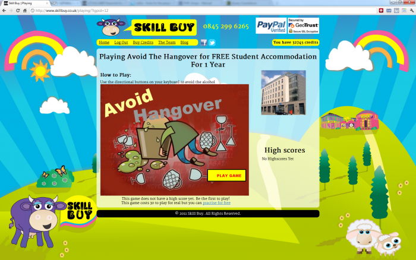</figure></li><li class="blocks-gallery-item"><figure>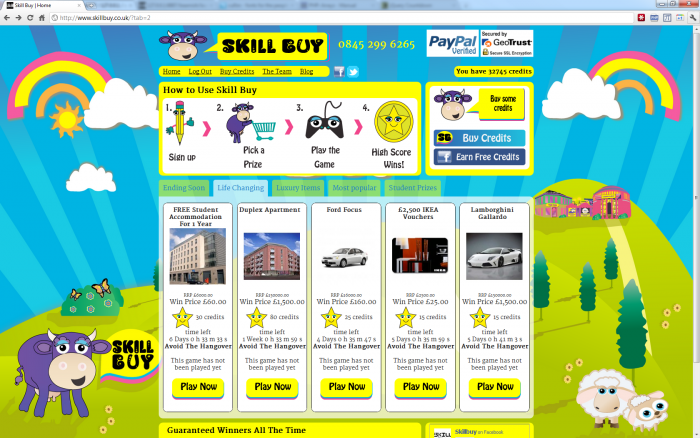</figure></li></ul></figure>

We'd launched the site, and they'd started running Facebook ads promoting it. Alex even ordered a
load of printed materials and signs to put up. I remember once, when giving me a lift home, he
pulled up and got out of the car to cable tie a Skill Buy banner to a railing at a set of traffic
lights. [We had people
playing](http://whatsthefunctionality.blogspot.com/2011/10/skillbuycouk-and-what-it-is.html) – you
got a few free credits after signing up, and some were actually buying credits too. The cheaper
gimmicky prizes had short timers on them, and we had winners claim prizes – which Liam shipped out.
We had some big prizes on there too, like a Rolex watch, a year's free accommodation, and a house.
The idea was that Andrew could give away use of some of Fresh Start's rental properties and even a
house, if the website made enough revenue. The accommodation and the house were on a 3-month timer,
and *surely* that would be enough time to build up the site user base.

<figure class="aligncenter size-large">
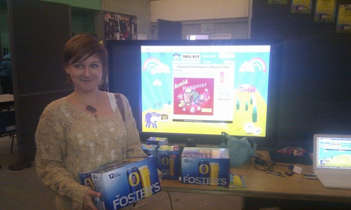
<figcaption>We ran a stall at the university fresher's fair to try to get some student interest. We
ran a special game where people played "Avoid the Hangover" on a projected screen to win "a mountain
of beer" (or "mountin" if you saw our printed leaflets).</figcaption>
</figure>

After a while, Andrew decided to make a change. Instead of buying credits, you would buy a ticket
for a game, and only when enough people had bought a ticket would the game open, to guarantee the
revenue covered the cost of the prize. This basically halted all activity on the site. Rather than
people playing games and competing for prizes, they were just waiting, and hardly anyone was
interested in buying tickets. It meant that the site was no longer spending any money on prizes, so
it didn't have any outgoings, but there wasn't any sign of it getting the number of users it needed.

While searching my inbox for anything related to App Start, I found this email from Andrew,
forwarded to me by Alex:

> Hi Ben – These are the skill buy changes required by andrew.  
> Begin forwarded message:  
> Make a skill buy section for property prizes only to replace any current property sections  
> Show 3 options talk about yields based on owning them cash  
> 1 terraced house  
> 1 appartment @ bispham  
> 3 student pods montgomery  
> Call all of there values 100 k plus    
> A ticket to enter costs 100 pounds only 1000 tickets available per game 1 winner is the highest
> scorer 72 hrs after the 1000 ticket is sold  
> Main selling points you give a 1 in 1000 chance of having the skill to win  
> Have it set up by monday as I will start selling tickets via telesales  
> Make it prominent easy to navigate and easy to pay( find a way)  and most importantly show number
> of people in the game to date  
> Have a section where they can note the name of the sales agent so we can pay comms  and obviously
> take clients details etc  
> Splash sites – probably hit 60000 people per week  
> Tele sales – will soon hit 100000 pple per week  
> 160,000 people per week all see or hear the message buy a investment property in addition they
> should see  
> 100 pounds 1 in 1000 chance to win a life changing investment property  
> 160,000 people per week @ 0.25 percent conversion – 40,000 pounds per week  
> The key to the conversion is making the site slick and appealing easy to fill in easy to pay easy
> to play etc if you make it slick simple salesy and appealing   
> If it works then in 3 weeks you would be giving away a house pr will do the rest.  !  
> Do it today tomorrow doesn't exist !  
> Sent using BlackBerry® from Orange

<figure class="aligncenter size-large">
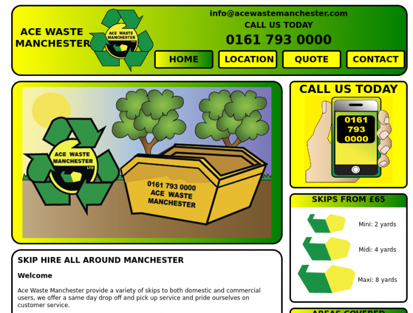
<figcaption>One day, Andrew brought in a friend who had his own skip company – and he introduced me
and said I would make him a website for his skip company.</figcaption>
</figure>

## Pigs Might Fly

Meanwhile, the rest of the team was working on iPhone games. There were some really talented
designers and developers there – and they produced some great games they were rightly very proud of.
They made a game called *Splat* (a bit like whack-a-mole) which was one of those addictive games,
and they managed to get a local radio station to interview them about it. They also made a game
called *Pigs Might Fly* – and they went all out with the marketing for this one. Alex got some large
pig signs printed and attached them to helium balloons and sent them flying around Manchester City
centre. They got everyone to text the radio station saying things like "I've just seen a flying pig
float past my car in Manchester" and they read a few of them out and asked if anyone knew what it
was about. Someone then called in to the radio show and went on air to promote the app. I've just
found the company [Twitter](https://twitter.com/AppStartUK),
[Flickr](https://www.flickr.com/photos/appstart/) and
[YouTube](https://www.youtube.com/user/AppstartLtd/videos) accounts are still live and it's all
there:

<figure class="wp-block-gallery columns-3 is-cropped wp-block-gallery-2 is-layout-flex wp-block-gallery-is-layout-flex"><ul class="blocks-gallery-grid"><li class="blocks-gallery-item"><figure></figure></li><li class="blocks-gallery-item"><figure>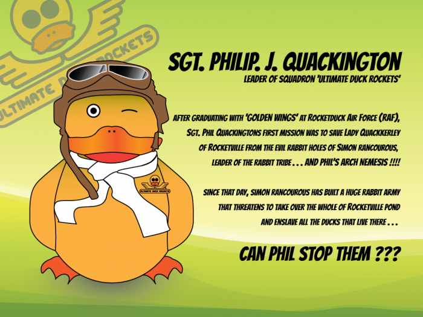</figure></li><li class="blocks-gallery-item"><figure></figure></li><li class="blocks-gallery-item"><figure>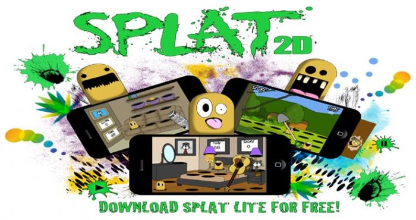</figure></li></ul></figure>

A point of contention was that Andrew wanted them to knock out as many apps as possible, and wait to
see if any of them got traction. But they wanted to choose an idea and spend a few months working on
it, to do a decent job.

## An app a day

Once I'd finished converting Skill Buy to its new format, it didn't need any ongoing work until it
had the users it needed, so I was asked to join the rest of the team building apps. We were assigned
to groups of three: two developers and a designer in each. We had to make 10 apps per group every
week. So each developer had to make an app a day, with the designer creating any assets we needed.
We just listed off a load of crappy ideas for things that you could make without any effort. They
were mostly either a multiple-choice quiz, or a button that did something silly. I was using
PhoneGap to bootstrap the apps, create the icons and metadata, and just writing the app logic in PHP
scripts which were hosted on the Skill Buy server. The apps looked terrible, they were pointless and
had no potential. But we were hitting our targets. Andrew also fed us his own ideas, such as the
"Ask an expert" series, where we'd build an app you could submit questions to, and an "expert" would
respond. He seemed to think he knew some experts.

Around this time, the same thing that happened to Bob had happened to Alex – he just came in and
shouted "I'm done, Cya!" and walked out. We knew he must have been on the receiving end of Andrew's
routine.

I had a similar experience with Andrew myself. One day, the web developer in the property business
was off sick and I was asked to cover for him, because Andrew had been promised that some new
feature was going to be ready by the end of that day. I was briefed by Steph from the property
business, and I had a Google Chat open with the developer. I did what was asked, and Steph was happy
with it. I was called in to present it to Andrew, who seemed to believe that this was not was he'd
asked for – so he ridiculed the work, called it a waste of time, told me to "go back to apps" and
proceeded to yell at Steph as I was leaving.

So we continued for a little while. We made our crappy apps. We hit our targets. We told our
19-year-old boss that we can't go on like this, that none of these apps were going to succeed. I
decided it was time to move on. I waited to the end of the month, made sure I'd been paid and I
politely told Liam I was leaving. They had never given me a contract, so I didn't have a notice
period or anything. I just left and started looking for something new. I bumped into one of the
designers a month or so later and he said that one day Andrew just closed them down and they all
lost their jobs.

It's a shame my first real job only lasted about 4 months, but it was a wild ride and a crazy
experience. I haven't really thought about that time much until now. Looking back, it feels so
strange and the story seems so surreal, so I felt like writing about it.

<figure class="aligncenter size-large">

<figcaption>The history of Skill Buy over the years – provided by archive.org</figcaption>
</figure>

## Andrew Camilleri, the Gazerati, and a suspended prison sentence

Andrew was quite the character, but he was nothing compared to Gaz. I think Gaz was Andrew's oldest
and best friend. When Andrew made his money, he hired Gaz to be his driver / bouncer. Gaz looked
like a bouncer. He was one of those people who you were terrified of at sight – but he was genuinely
pleasant and nice to talk to. One day, we heard a vehicle driving around the car park making a lot
of noise. Andrew had just purchased a *Maserati* as a "present" for Gaz – to drive him around in,
and they were doing laps of the industrial estate. Naturally, this car became known as the
*Gazerati*.

While researching online for this article, I came across a news article entitled *[Property
developer given suspended prison
sentence](https://www.placenorthwest.co.uk/news/property-developer-given-suspended-prison-sentence/)*,
which starts:

> Andrew John Camilleri, a businessman formerly associated with wound-up property company Fresh
> Start Living, has been unanimously convicted by a jury at Manchester Crown Court of making false
> representations in an Individual Voluntary Arrangement proposal.
>
> placenorthwest.co.uk

It also states that in early 2011, Andrew made false representations to creditors in attempt to wipe
out debts of £9m. So rather than being a millionaire, he was actually the opposite – a negative
millionaire. And it seems Fresh Start Living, like App Start Ltd, is no more.
