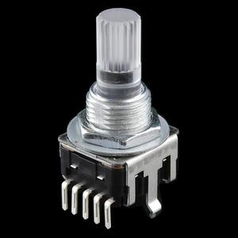
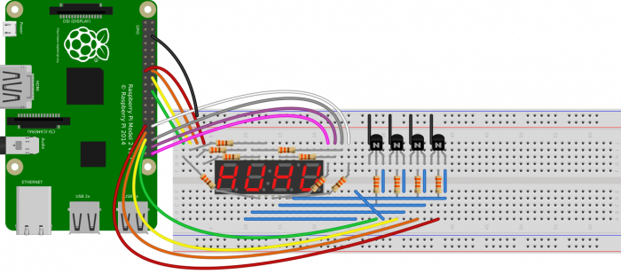
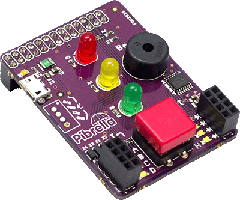
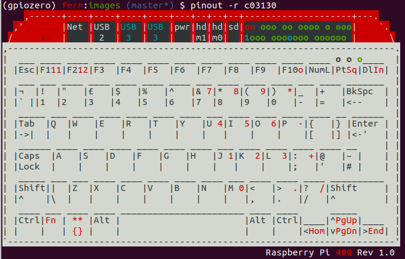
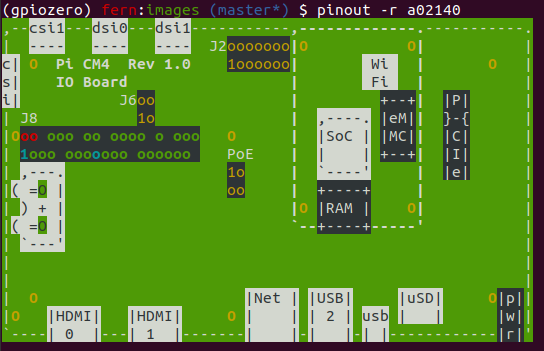

Dave and I just did a release of [GPIO Zero](https://gpiozero.readthedocs.io/en/stable/), our
Raspberry Pi GPIO library. It's been over 18 months since the last release, and as well as plenty of
small bugfixes and corrections to the documentation, there are a few nice new features too.

The highlights:

- Rotary Encoder
- Multi-segment displays, including custom "font" support for them
- Pibrella and TrafficpHat boards
- New pin factory for the lgpio library
- Event-driven functionality for internal devices
- Improvements to Energenie
- Added ASCII art for Pi 400 and CM4
- Using BOARD numbering (under-the-hood) for add-on boards
- Improved SPI support
- Fixed ButtonBoard release events

## Rotary Encoder

The rotary encoder is a nifty electronic component which works like a potentiometer but can be
rotated infinitely, and each turn is distinct (both audibly with a click, and as detected in the
hardware). The GPIO Zero interface allows hooking events to each click (in one direction or both),
and its value space can be either be infinite or it can wrap around.

```python
from gpiozero import RotaryEncoder
from gpiozero.tools import scaled_half

rotor = RotaryEncoder(21, 20)
led = PWMLED(5)

led.source = scaled_half(rotor.values)
```

<figure class="wp-block-image">

</figure>

## Multi-segment displays

Martin O'Hanlon opened a pull request for 7-segment displays some time ago, and so Dave started with
what Martin gave us and built support for not just 7-segment but any multi-segment displays,
including multiplexed multi-character displays. There's even a "font" interface if you want to
create custom character maps:

<figure class="wp-block-image">

</figure>

## Pibrella

This seems like an odd thing to add in 2021, but we had a pull request for it, so why not?

<figure class="wp-block-image">

</figure>

One interesting thing about our interface to it is the way the input and output channels are exposed
as pins, allowing you to create other GPIO Zero devices from them without looking the pin numbers
up:

```python
from gpiozero import Pibrella, LED, Button

pb = Pibrella()
btn = Button(pb.inputs.a, pull_up=False)
led = LED(pb.outputs.e)

btn.when_pressed = led.on
```

## lgpio

A new pin factory was needed for the upcoming Ubuntu release, as the old way GPIO libraries worked
has now been deprecated. Ubuntu users should use the new lgpio pin factory now. Read more about
[changing the pin factory](https://gpiozero.readthedocs.io/en/stable/api_pins.html) in the docs.

## Event-driven functionality for internal devices

GPIO Zero also provides several "internal" devices which represent facilities provided by the
operating system itself. These can be used to react to things like the time of day, or whether a
server is available on the network.

These devices provide an API similar to and compatible with GPIO devices so that internal device
events can trigger changes to GPIO output devices the way input devices can. In the same way a
`Button` object is *active* when it's pressed, and can be used to trigger other devices when its
state changes, a `TimeOfDay` object is *active* during a particular time period.

However, the functionality for event-driven code using these devices was unimplemented until this
version. You can now use event-driven code to run code when an internal device's state changes:

```python
from gpiozero import LED, TimeOfDay
from datetime import time

led = LED(2)
tod = TimeOfDay(time(9), time(10))

tod.when_activated = led.on
tod.when_deactivated = led.off
```

## Added ASCII art for Pi 400 and CM4

The `pinout` command line tool GPIO Zero provides includes neat ASCII art diagram showing the pinout
and board layout of the Pi model you're on. We just added layouts for the Pi 400 and CM4:

<figure class="wp-block-image">

</figure>

<figure class="wp-block-image">

</figure>

## Using BOARD numbering (under-the-hood) for add-on boards

A few versions ago, we added support for using BOARD numbering when specifying which pins to create
devices on, but rather than set a global to say which method you're using, it's inferred by the way
you refer to the pin as a string. Instead of the integer 17, you could use the string `BOARD11` when
creating an LED:

```python
led = LED('BOARD11')
```

And in this release, we swapped to using board numbering internally whenever constructing devices
for physical boards, such as the Energenie. This means that if (in the increasingly small chance)
you're using an old Pi 1 rev1, and the pinout is slightly different, GPIO Zero will convert the
physical BOARD numbers to BCM numbers, and they'll be right for the pinout of whichever board you're
on.

## Fixed ButtonBoard release events

`ButtonBoard` allows you to create a single object which listens to the state changes of a number of
buttons, and either fire events when the collection is activated or deactivated, or read the "value"
of the collection. There was a bug identified which mean `ButtonBoard` release events fired as press
events – this is now fixed.

## Next up, GPIO Zero 2.0

This is the last release to support Python 2. Our next step will be to start removing the messy 2/3
compatibility code and prepare for the next release to be Python 3 only. It'll be the first time
we've broken backwards compatibility, so it'll be a v2.0 release.

Thanks to all the new contributors!
