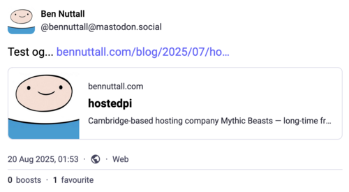
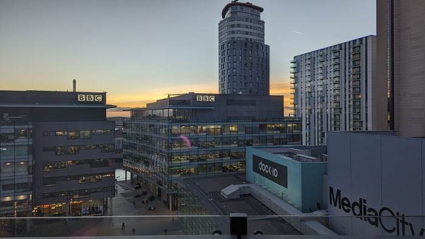

I have a habit of revamping my website every few years. Since starting on Blogger some ... 19 years
ago I've moved between platforms and redesigned the layout several times over.

This time I decided to go for a static site build, which means not requiring managing WordPress
plugins and updates, or running PHP on my server. It'll also perform a lot better if I get another
big hit, like [The surreal experience of my first developer
job](/blog/2021/04/the-surreal-experience-of-my-first-developer-job/) which sat at the top of
[Hacker News](https://news.ycombinator.com/item?id=28058816) for a whole day.

My regular site revamping has been documented over the years...

> I decided I needed a new website template so I made one

— [Version 3 and Problems with IE](/blog/2009/04/version-3-and-problems-with-ie/) (2009)

> I have to make a series of decisions - where do I take the blog, and how do I get it there? Do I
> migrate to another blogging service - and if so, temporarily or permanently? Do I write my own
> temporary fix? Do I write my own blogging platform - and if so, would it work in the same way
> Blogger did?

— [Goodbye Blogger?](/blog/2010/02/goodbye-blogger/) (2010)

> I wonder how long before I get bored of this template and create or find another!

— [Blogging about blogging](/blog/2020/05/blogging-about-blogging/) (2020)

The [2010 post](/blog/2010/02/goodbye-blogger/) also included a prediction which seems to have come
true:

> Ideally, in time, I will write my own Content Management System which will manage my entire site,
not just the blog. It will work exactly how I want it to, and it will be perfectly suited my own
personal requirements - bespoke for my own purposes. PHP may be the language I write this in - it
may not. By the time I get round to doing it properly I might be writing in a completely different
language.

About that...

## The project

For now I've kept the layout the same, but I built a markdown based static site generator. I
absolutely could have used one of the many frameworks that do exactly this, but I just
*really fancied* having a go at writing my own in Python. It has a [blog index](/blog/), an
[archive](/blog/archive/), archives by [year](/blog/2021/) and [month](/blog/2021/04/),
[tags](/blog/tags/), an [XML sitemap](/sitemap.xml) and an [Atom feed](/atom.xml). It also supports
Twitter cards and general [OpenGraph](https://ogp.me/) tags for other social media sites such as
[Mastodon](https://mastodon.social/):

<figure class="wp-block-image">

</figure>

I didn't spend very long building the new site, and I enjoyed working on it. It's quite satisfying
building something of your own, and it's much easier to get done quickly with ChatGPT and a wealth
of open source tools available.

I used [Chameleon](https://chameleon.readthedocs.io/en/latest/),
[Pydantic](https://docs.pydantic.dev/latest/), [markdown](https://pypi.org/project/Markdown/),
[pyyaml](https://pypi.org/project/PyYAML/) and
[BeautifulSoup](https://pypi.org/project/beautifulsoup4/).

The source code for the site generator is available on my GitHub. I called it
[Beemo](https://github.com/bennuttall/beemo) and I've released it to
[PyPI](https://pypi.org/project/beemo/). I'll try to make it more generalised to be useful to
others.

## Content

I wrote a [script](https://gist.github.com/bennuttall/5505efe6f52b875e4c4a547374af5bfb) to pull all
the posts from my WordPress site via its JSON API, keeping their titles, slugs and tags along with
the content. I used [pandoc](https://pandoc.org/) to mangle the HTML content;
[BeautifulSoup](https://pypi.org/project/beautifulsoup4/) to extract the images; and
[imagemagick](https://imagemagick.org/) to resize them. I ran the same script on my abandoned
*Tooling Tuesday* blog, a separate WordPress instance, to bring those posts in too.

I also copied the source of some of the article I wrote for
[opensource.com](https://opensource.com/) which stopped running a couple of years ago. I had another
look through my old Blogger account, and found a few really old posts I wanted to preserve, like
[Athletics?](/blog/2008/09/athletics/) and [My Received Files](/blog/2007/01/my-received-files/) so
I've ported those over too.

## BBC

One thing that struck me while looking back at the content is the number of old posts tagged with
[bbc](/blog/tags/bbc/) or [bbc news](/blog/tags/bbc-news/), either written about or referencing
BBC News articles, or about BBC TV shows.

One was about an [event](/blog/2012/04/hack-to-the-future/) I was involved with which [BBC R&D wrote
up](https://www.bbc.co.uk/blogs/researchanddevelopment/2012/04/teaching-coding-to-kids-at-hac.shtml)
on their blog (and looking now I recognise some of the names on that site); one was about a time in
2007 when my parkour group was [filmed for a regional TV show](/blog/2007/08/trace-gathering-2007/)
which was [broadcast in 2008](/2008/01/us-on-bbc-inside-out/); another in 2009 where we were
[auditioned for a TV programme](/blog/2009/04/lots-of-training-and-a-session-with-the-bbc/) about
intelligence stereotypes. One time I had an [eventful kayaking trip](/blog/2012/10/hero-kayakers/)
which was [covered by BBC News](https://www.bbc.co.uk/news/uk-england-manchester-19735175). I even
posted about [the death of Ronnie Corbett](/blog/2016/03/fork-handles/) in 2016, and related this to
[GitHub](https://github.com/bennuttall/handles).

<figure class="wp-block-image">

<figcaption>BBC at Media City</figcaption>
</figure>

I was a student in Manchester when Media City was being built, and the BBC were beginning to set up
a new base there. I loved the idea of getting a job there once I finished university. I didn't see
anything relevant at the time and for some reason I hadn't been looking at graduate schemes. It
wasn't until I happened to spot a vacancy in [BBC News Labs](https://www.bbc.co.uk/rdnewslabs) in
2019 that I finally put in an application, and started in January 2020, initially in London. Later I
relocated back to Manchester and ended up with Media City as my base. So I got there eventually!