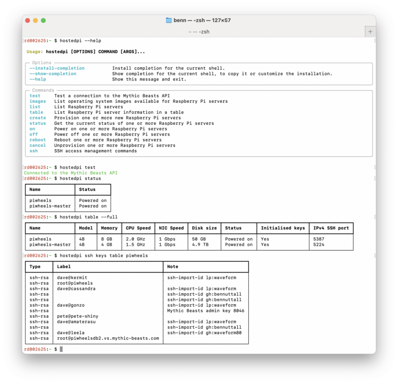

Cambridge-based hosting company [Mythic Beasts](https://www.mythic-beasts.com/) — long-time friends
of Raspberry Pi people and products — launched a unique service back in 2016: Raspberry Pi hosting,
what they call their "[Pi Cloud](https://www.mythic-beasts.com/order/rpi)".

<figure class="wp-block-image">

</figure>

When I developed the first version of [piwheels](https://www.piwheels.org/), it made sense to make
use of this service to natively compile Python packages on Raspberry Pi hardware. When I'd proved
that the idea worked in concept, I knew I needed several Pis to complete the backlog for completion.
Mythic were more than happy to provide this, and have effectively sponsored the running of the
project ever since. Piwheels has proven how capable their Pi Cloud is – delivering [hundreds of
millions of downloads](https://blog.piwheels.org/half-a-billion-downloads/) from a single Pi. It's
been a great selling point for them.

They later introduced a [web API](https://www.mythic-beasts.com/support/api/raspberry-pi) for
provisioning and managing Pis in their cloud. I initially used a simple script to help provision Pis
as I needed them. I later developed a Python library and CLI providing the full range of features,
and gave a [talk](https://www.youtube.com/watch?v=9wNYRF5DGdk) on it at a Raspberry Pi meetup.

I just finished off a revamp of the library, including using
[Pydantic](https://docs.pydantic.dev/latest/), and a new CLI built with
[Typer](https://typer.tiangolo.com/).

<figure class="wp-block-image">

<figcaption>The new piwheels CLI in all its glory</figcaption>
</figure>

- The package can be found on [PyPI](https://pypi.org/project/hostedpi/) (and
  [piwheels](https://piwheels.org/project/hostedpi/), of course)
- Documentation is on [readthedocs](https://hostedpi.readthedocs.io/en/stable/)
- The source is on [GitHub](https://github.com/piwheels/hostedpi)

It's been a pleasure to use Pydantic to manage data models for the API requests and responses, and
to provide an easy way for users to create validated Pi specs. Typer made it easy to create a
practical CLI with all the bells and whistles, and no boilerplate. I'll be giving a workshop at
[PyCon UK 2025](https://2025.pyconuk.org/) on data modelling with Pydantic, covering
[FastAPI](https://fastapi.tiangolo.com/) and Typer too.
