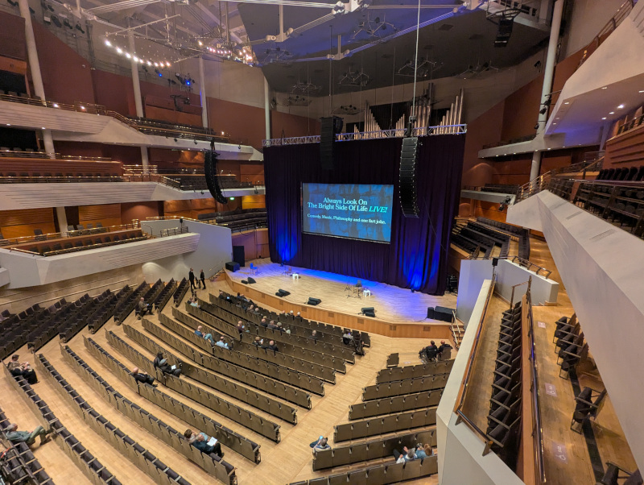
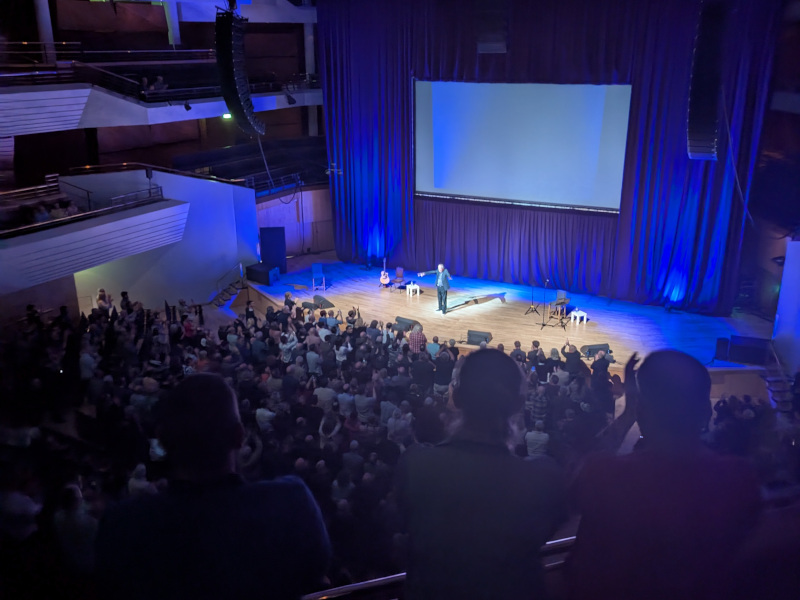
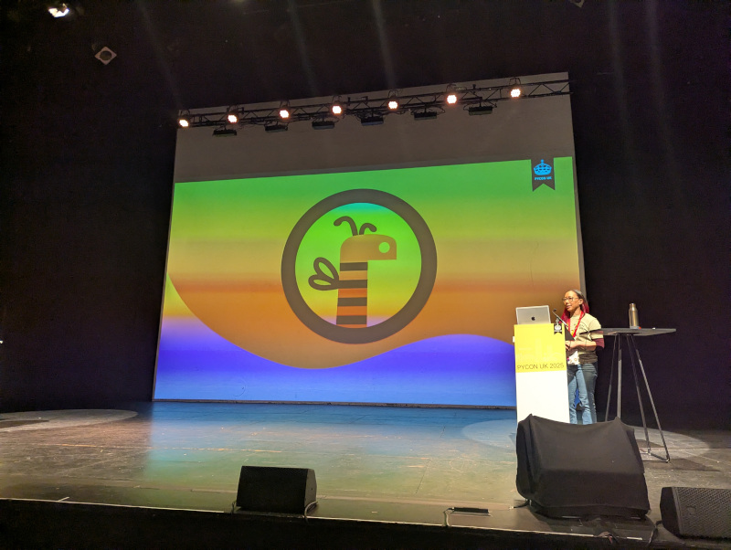
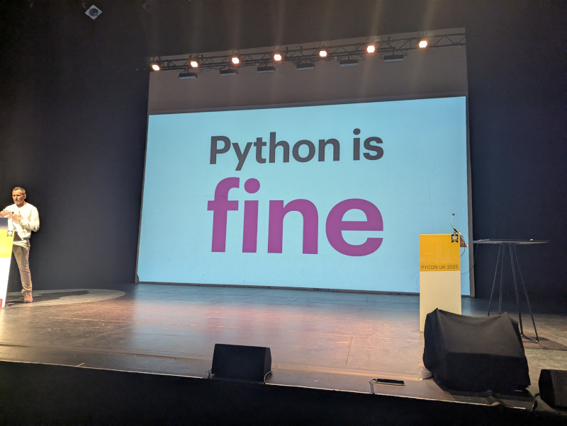
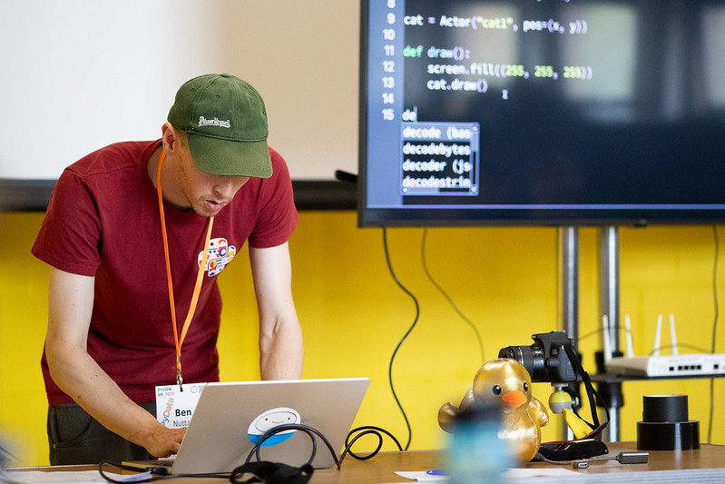
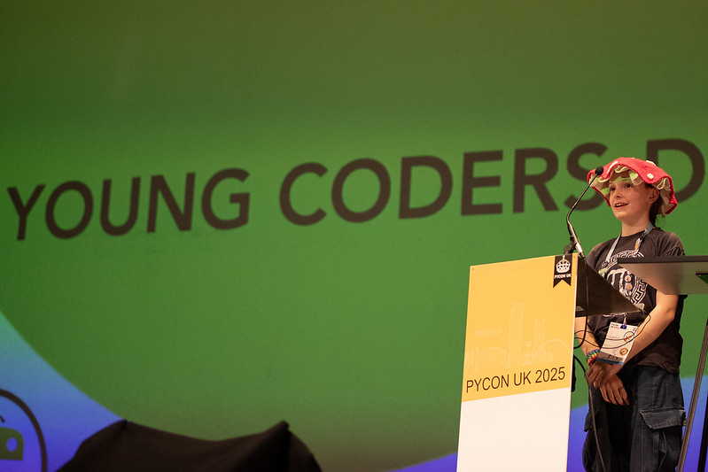
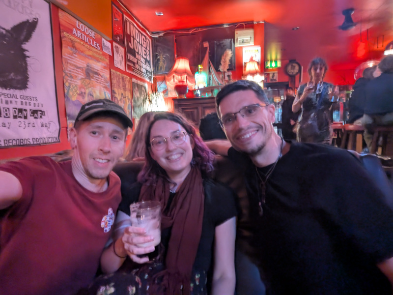
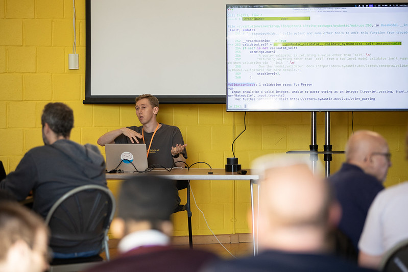

Last week was [PyCon UK](https://2025.pyconuk.org/), which took place in Manchester for the first
time. I've attended the conference every year it's run since 2014, and each year I've given a talk.
This year I decided not to submit a talk, instead trying my hand at running a workshop on "Data
modelling with Pydantic". Luckily, my proposal was accepted and over the last few weeks I've been
preparing for it. It ended up being a *lot* more effort preparing a 90 minute workshop than a 25
minute talk!

PyCon UK is a unique conference in many ways. One of the *many* inclusive initiatives it runs is a
"young coders" track on the Saturday, giving local kids and often the children of attendees the
chance to have a go at some programming activities. Workshops are operated on a proposal basis like
the main conference, so they're run by attendees.

The day before the conference started, Claire Wicher asked me to see if I could step in to run a
workshop on the kids track. I'm not very good at saying no - so I said I'd find something. I asked
around and my good friend Nicholas Tollervey was able to provide me with a brilliant worksheet using
Dan Pope's [pygame-zero](https://pygame-zero.readthedocs.io/en/stable/) and the
[Mu editor](https://github.com/mu-editor/mu) (unfortunately, now a retired project).

The evening before the first day, as attendees started arriving in town, a bunch of people ended up
in the [Temple of Convenience](https://share.google/Ma3XYO9ncyKDHdosk), an old public toilet on
Oxford Street, converted into a bar. We proceeded to move to
[Society](https://www.societymanchester.com/) to get food, and I remembered that [Eric
Idle](https://en.wikipedia.org/wiki/Eric_Idle) of [Monty
Python](https://en.wikipedia.org/wiki/Monty_Python) was playing a show over the road from there at
[Bridgewater Hall](https://www.bridgewater-hall.co.uk/). I asked one of my new friends if he fancied
seeing if there were walk-in tickets available, and we ended up seeing the show, which was great
fun.

<figure class="wp-block-image">

</figure>

<figure class="wp-block-image">

</figure>

The conference opened with the usual introduction, which included Becky Smith unveiling the new
PyCon UK logo, based on the [Manchester worker
bee](https://en.wikipedia.org/wiki/Symbols_of_Manchester#Worker_bee) representing the hard work done
by volunteers to make the conference happen:

<figure class="wp-block-image">

</figure>

The opening keynote was a brilliant commentary on the history, growth and development of Python's
rich and complex ecosystem since the launch of Python 3:

<figure>
<iframe width="560" height="315" src="https://www.youtube.com/embed/gDvwRpl9erE?si=_wnWPcL4D5soxxG-" title="YouTube video player" frameborder="0" allow="accelerometer; autoplay; clipboard-write; encrypted-media; gyroscope; picture-in-picture; web-share" referrerpolicy="strict-origin-when-cross-origin" allowfullscreen></iframe>
</figure>

<figure class="wp-block-image">

</figure>

The second day included the young coders day in the workshop space. Here's a photo of me running the
workshop:

<figure class="wp-block-image">

<figcaption><a href="https://www.flickr.com/photos/203482025@N06/54799967120/in/album-72177720329149392">Photo</a> by Mark Hawkins</figcaption>
</figure>

The pygame-zero workshop went really well. It was an ideal activity as there wasn't too much typing,
people could go at their own pace as it didn't rely on following what was on screen, and it was fun
to make a silly splat-a-cat game.

After the day's talks are over, there's a slot before the lightning talks where the kids get to
present on the main stage, such as projects they've worked on, and anything they want to share.
It's amazing how confident they can be on stage in front of so many people - showing the game
they've made with Python or telling everyone what they enjoyed or found difficult. They always
manage to make the audience smile, laugh and applaud like mad.

<figure class="wp-block-image">

<figcaption><a href="https://www.flickr.com/photos/203482025@N06/54800924813/in/album-72177720329149392">Photo</a> by Mark Hawkins</figcaption>
</figure>

<figure class="wp-block-image">

<figcaption>In Big Hands with Eloisa and Ben</figcaption>
</figure>

Day three, Sunday, was the day of my workshop. I've run countless workshops before, but mostly for
kids, teachers or complete beginners. This one was more targeted at peers. It was intended to be
suitable for less experienced Python users but relied on some basics, and dove deeper than a
standard beginner workshop would.

The workshop room was packed out, with all desk spaces filled and a couple of people joining from
the floor! The wifi provided by the venue was poor so I'd asked people intending to attend to clone
the repo ahead of time, and turn up early if they needed help getting set up. Some people didn't see
the message but we managed to get everyone sorted and started just about on time. There were a few
people with Windows laptops so I had to look up the virtualenv activation instructions for them. One
guy even turned up with an Android tablet. He seemed to know what he was doing, and had vscode and
Python running on there somehow, although it was a bit awkward tabbing between the editor and
instructions.

Rather than use slides, I'd written up the steps and code examples in a series of markdown documents
on a GitHub repo, so people could follow along, copy-pasting code with me as I talked through it.
This also meant that they could take it home to continue if we didn't get through it all. David
Seddon had to head home early so he missed the workshop, but told me he completed it on the train
home!

The workshop went well, and people seemed to get a lot out of it. I probably tried to squeeze in too
much, but that's not so bad as they were able to take it home and carry on. I covered Pydantic,
built a little FastAPI app and touched on Typer for making CLIs. The workshop materials are
available on GitHub if you want to have a go yourself:
[https://github.com/bennuttall/pydantic-workshop](https://github.com/bennuttall/pydantic-workshop)

<figure class="wp-block-image">

<figcaption><a href="https://www.flickr.com/photos/203482025@N06/54802069465/in/album-72177720329168007">Photo</a> by Mark Hawkins</figcaption>
</figure>

This was the first PyCon UK since we lost our dear friend [Michael
Foord](https://ntoll.org/article/my-friend-michael/). We raised a glass to him in the pub on the
last day of the conference and shared fond memories of him.

The keynotes and talks are all recorded and promptly uploaded to YouTube and can be found here:
[https://www.youtube.com/@PyconUKSoc/videos](https://www.youtube.com/@PyconUKSoc/videos)

The official photos taken by the photographer Mark Hawkins are available on Flickr:
[https://www.flickr.com/photos/203482025@N06/albums](https://www.flickr.com/photos/203482025@N06/albums)

See you there next year, I hope!