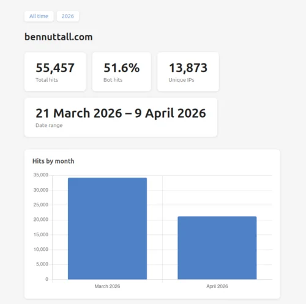
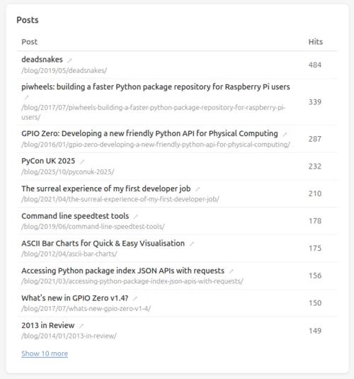
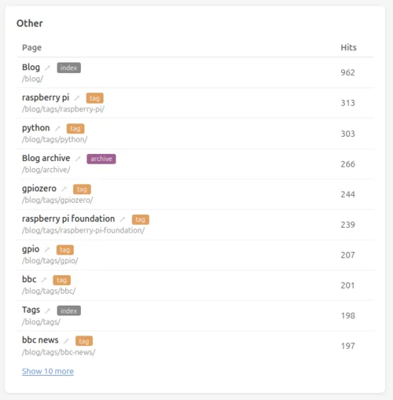

Last Summer I wrote about [building my own static site
generator](/blog/2025/08/another-website-revamp/) called [Beemo](https://pypi.org/project/beemo/).
I went on to use it as the generator for a few other websites I manage, and made a few enhancements
along the way.

Recently I had the idea to use [lars](/blog/2020/06/lars/) (a web server log analyser written by
Dave Jones) as the basis of an analytics site builder. We use lars in the
[piwheels](https://www.piwheels.org/) project to count [wheel
downloads](https://blog.piwheels.org/2024/07/half-a-billion-downloads/), and also web page hits for
the few pages we have on the site.

I've been using the [Claude](https://claude.ai/) CLI to help me with tasks recently so I wanted to
guide it through building out what I had in mind.

I took the log processing lars code from piwheels, stripped out some piwheels-specific stuff and
asked Claude to make it generate a CSV file of just requests to HTML index pages with an HTTP 200
status code, given a gzipped Apache log file. We iterated on it, adding user agent parsing and bot
detection, and then I asked it to turn it into a library instead of just a script.

My process with Claude is to start by giving it some background context, pointing it at some
libraries and things I want it to observe, then iterate by guiding it to do one task at a time with
a clear goal, reviewing the approach — the same way I would build something myself. I wish I'd been
committing along the way — and it would probably make sense to store the prompts along with the
commit message, otherwise you end up with very large diffs you can't easily review, wind back or
investigate regressions. I need to get better at that.

If I want to explore an idea but don't know exactly what I want, that's when I'm less prescriptive.
Once we'd built the log parsing how I wanted, I wondered if Claude could turn it into an analytics
site by itself — I let it have a go:

> Make an HTML stats page based on the one CSV

I had no opinions about how it should lay out the HTML, CSS and JavaScript, or which graphing
library to use — or even what I wanted it to include. But what it did produce looked ideal — simple
and modern design reporting on numbers, graphs, and lists of pages.

I then wanted to see if we could integrate this with Beemo:

> The website is generated by my static site builder (beemo) and the content is in a git repo. I've
> checked out both repos here. Since we have access to the generator, the exact structure of the
> output and the page metadata (titles etc), it might be a good idea to add the lars analytics to
> beemo, and be able to extract the page title and such in reporting. Inspect both beemo and
> web-content and make a plan for how we can integrate lars log analysis and reporting for a site
> like this.

Now we had page titles, and it added labels for page types (page, post, tag, etc).

I gave it a month's worth of logs, and initially it made an HTML page per log file, as an
extrapolation of the initial task of doing it for a single log file, which isn't really what I
wanted. I assumed we'd need to combine them all to summarise everything, so I asked:

> If I want a summary combining all data from all CSVs should we combine them in an sqlite db or
> something?

Interestingly, it pushed back rather than assuming I was right or that's what I wanted. We pressed
on just using the combined CSVs, and continued a few more iterations making tweaks. We then moved
the log processing and analytics site generation code into the Beemo library, giving `beemo` three
subcommands:

```
build       Build the site.
logs        Process Apache log gz files into CSV.
analytics   Generate HTML analytics site from log CSVs.
```

We iterated on some finer details — what to exclude, separating page hits with blog posts and things
like tag and archive pages, date and number formatting, and colouring the bot user agent bars in
grey.

I finished things off, added a [readthedocs](https://beemo.readthedocs.io/) site and prepared a new
release for PyPI, and configured it to automatically build the analytics site on my web server.

I now have a content-aware bot-aware self-hosted analytics site for my website:

<figure class="wp-block-image">
<a href="https://files.bennuttall.com/beemo-analytics-demo"></a>
<figcaption>Beemo analytics</figcaption>
</figure>

<figure class="wp-block-image">
<a href="https://files.bennuttall.com/beemo-analytics-demo"></a>
<figcaption>Top posts</figcaption>
</figure>

<figure class="wp-block-image">
<a href="https://files.bennuttall.com/beemo-analytics-demo"></a>
<figcaption>Best of the rest</figcaption>
</figure>

I've archived a snapshot of the current analytics by means of a demo:
[https://files.bennuttall.com/beemo-analytics-demo](https://files.bennuttall.com/beemo-analytics-demo/)

I've configured analytics for the four websites I'm currently generating with Beemo on my server,
thanks to logrotate, Apache vhosts, certbot and a cron job, it's all working smoothly.

It's early days, I'm bound to want to explore this more, and will probably find that it doesn't work
effectively for a large dataset, but I'll see how it goes and update it as needed.

*Please note that despite the enthusiasm for Claude, and the use of em dashes throughout, I can
confirm I have written this post myself.*

What are you waiting for? Try <s>Claude</s> Beemo today!