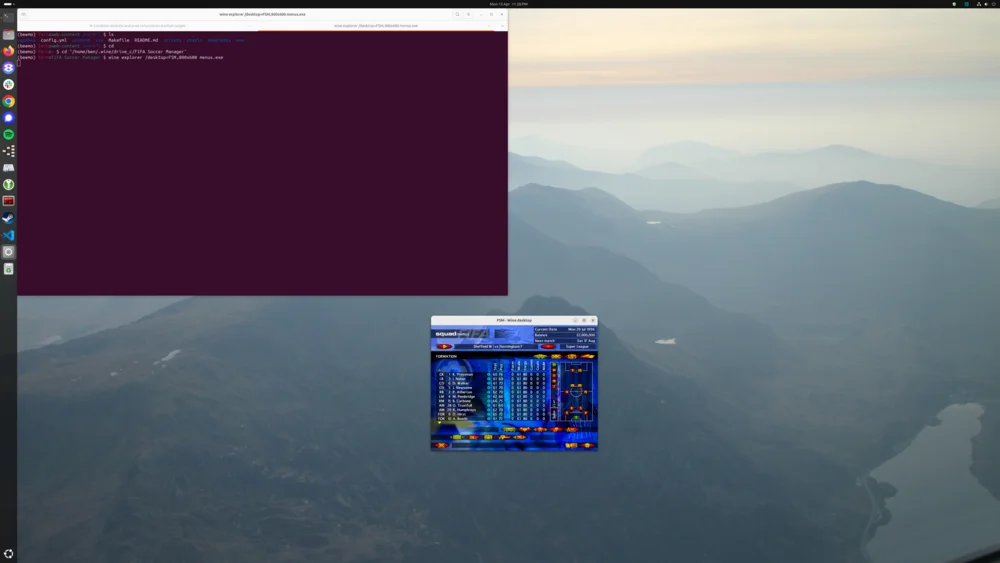
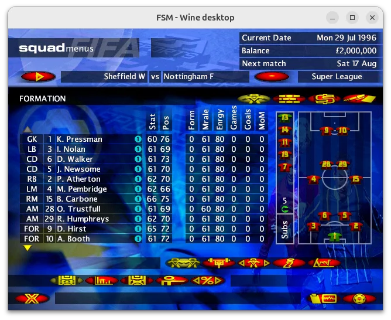
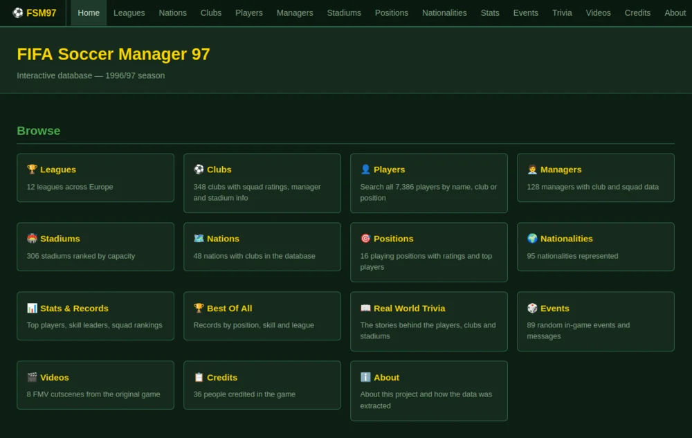
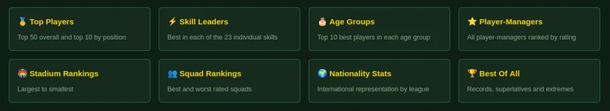
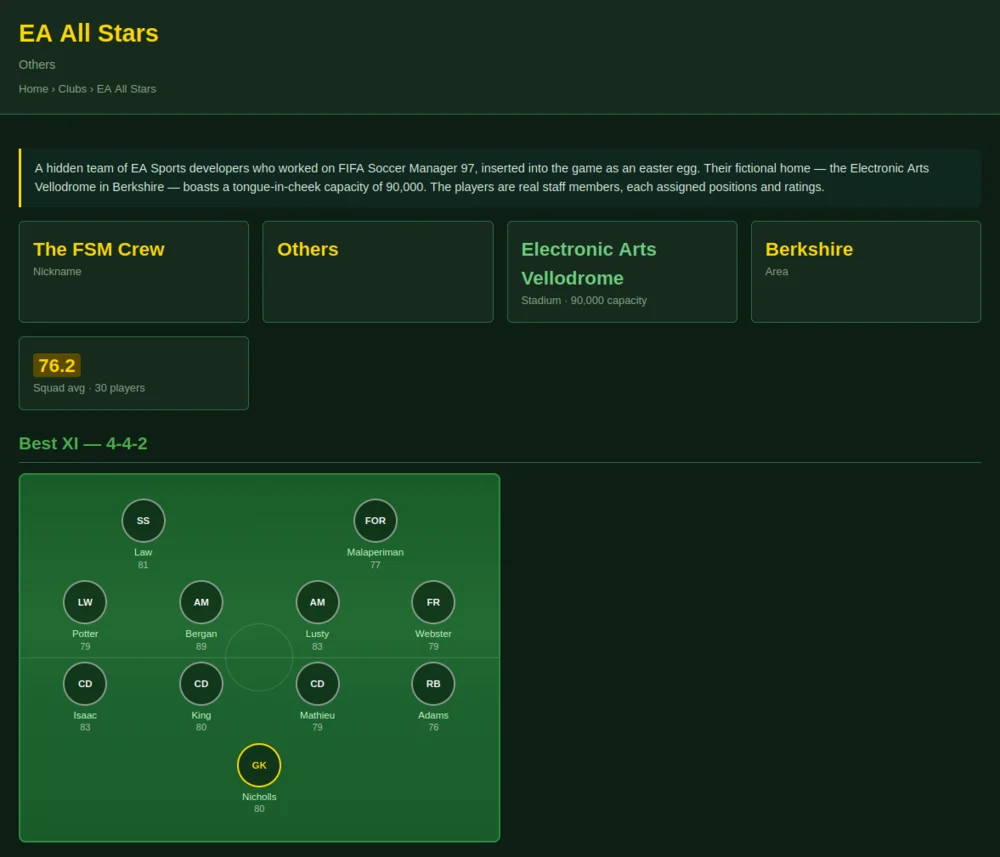
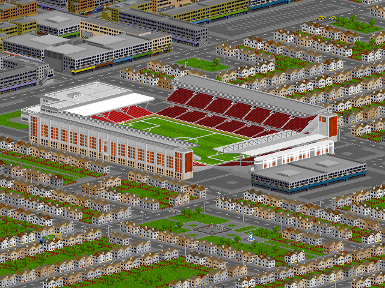

There's a football manager game I got for my birthday when I was nine years old: [FIFA Soccer
Manager](https://www.mobygames.com/game/6314/fifa-soccer-manager/)
97. I spent countless hours playing it as a child, trying to win the league, the cup or just avoid
getting the sack! Two years later I got a newer manager game with better graphics and more complex
gameplay but it ran incredibly slow and I didn't enjoy playing it at all, so I stuck with the 1997
one.

Every couple of years I get it out again and spend an evening basking in nostalgia and reliving the
experience. Originally it was made for Windows 95, and it was still working on Windows until (I
think) Windows 10. But it works perfectly well in Wine on Linux, so I can still play it today. It
just has a teeny tiny resolution and looks silly on my 42" monitor.

<figure class="wp-block-image">

</figure>

<figure class="wp-block-image">

</figure>

I wondered if I could get [Claude](https://claude.ai) to extract data from the game files. I pointed
it at the directory my Wine installation installed to. I told it I was only interested in players,
teams, stadiums and that kind of thing - the stuff that maps to the real world of football rather
than internal game data. It found everything in the file `SM97.DAT` and was very quickly able to
answer simple questions like which is the biggest stadium or who is the best rated player.

I asked it to make an HTML page summarising all the data. It produced this:
[https://files.bennuttall.com/fsm97/](https://files.bennuttall.com/fsm97/)

I asked it to create CSV files of all the data it found, so I could make sense of it and make sure
it looked right. There were a few issues with it messing up the data but it was easily able to fix
it. It didn't know what all the column names for the player stats were, so I launched the game and
wrote them all down along with David Seaman's stats so it could calibrate. I expanded the scope to
all players and clubs, not just the English leagues.

Once I was happy with the CSV files, all future queries would be scripted against these files so I
could be sure it was coming from extracted data and not extracting from the game data again or even
hallucinating. I then asked for a more comprehensive website of all the data, with lots of
interlinking. I was really impressed with what it put together, and I spent some time diving deeper
into the data and making tweaks to the website.

I wanted to produce a set of Python code to make this process reproducible, so if anyone else wanted
to do it they could do so without needing an AI tool of their own. It's now on
[GitHub](https://github.com/bennuttall/fsm-97-data), and I've published the website too:
[fsm.bennuttall.com](https://fsm.bennuttall.com/)

<figure class="wp-block-image">
<a href="https://fsm.bennuttall.com/"></a>
<figcaption>fsm.bennuttall.com</figcaption>
</figure>

I've worked with Claude to fine-tune the way the website works, trying to interlink everything and
make it easy to find what you're looking for, or explore the data looking for interesting things.

## Stats, trivia and EA All Stars

I always found it annoying that it only ever used short versions of team names like "Sheffield W"
instead of "[Sheffield Wednesday](https://fsm.bennuttall.com/clubs/sheffield-wednesday/)",
purely to keep the strings short enough to use everywhere. I had Claude correct them to their proper
titles. Stadium names are not used in the game, but they all exist in the game data, albeit with odd
mistakes sometimes, like "[Bramall Lane
Ground](https://fsm.bennuttall.com/stadiums/bramall-lane/)". I corrected those too. Some more
obscure club or stadium names were just wrong so I fixed those too. I didn't want to mess with too
much of the game data, but felt these changes were reasonable.

One thing I found interesting was that there's data in there that isn't used in the game at all.
Players go by first initial and Surname, like "D. Beckham", but the data has "[David
Beckham](https://fsm.bennuttall.com/clubs/manchester-united/#david-beckham)". It has all the
manager names of all English leagues and a few others, but they're never used in game. Same for club
nicknames and stadium names (and sometimes town/city and even first line of address!).

This revealed oddities like P. Shilton in the game actually being former England goalkeeper [Peter
Shilton](https://fsm.bennuttall.com/clubs/leyton-orient/#peter-shilton), who really did play for
[Leyton Orient](https://fsm.bennuttall.com/clubs/leyton-orient/) until 1997, at the age of 47;
and oddly, Olympic decathlon champion [Daley
Thompson](https://fsm.bennuttall.com/clubs/mansfield-town/#daley-thompson) at [Mansfield
Town](https://fsm.bennuttall.com/clubs/mansfield-town/) (an easter egg).

I didn't realise there were some clubs that shared stadiums, which is reflected in the game. I
wonder if you managed [Wimbledon](https://fsm.bennuttall.com/clubs/wimbledon/) and expanded the
stadium ([Selhurst Park](https://fsm.bennuttall.com/stadiums/selhurst-park/)), if you played against
[Crystal Palace](https://fsm.bennuttall.com/clubs/crystal-palace/) away, would you see the ground at
its default appearance or would you in fact see your own upgraded home stadium? (The Reddit
community confirms they do appear as different stadiums!)

I made sure the extracted data was aware of the concept of shared stadiums, and it also picked up on
the fact that some of the clubs' managers were also listed as players for the same club - a once
popular "player-manager" role.

I put together a few special pages showing some interesting stats, such as [top rated
players](https://fsm.bennuttall.com/stats/top-players/), [top 10 best players in each age
group](https://fsm.bennuttall.com/stats/age-groups/), [top rated
player-managers](https://fsm.bennuttall.com/stats/player-managers/) and [stadiums by
capacity](https://fsm.bennuttall.com/stats/stadiums/).

<figure class="wp-block-image">
<a href="https://fsm.bennuttall.com/stats/"></a>
</figure>

One thing that stands out in top player stats is a set of highly rated players from a club called
"[EA All Stars](https://fsm.bennuttall.com/clubs/ea-all-stars/)". None of these are real players —
they're actually the game developers and other staff who worked on the game. The Assistant Producer
[Mark Bergan](https://fsm.bennuttall.com/clubs/ea-all-stars/#mark-bergan) made himself one of the
best rated players in the whole game, rated as highly as [David
Seaman](https://fsm.bennuttall.com/clubs/arsenal/#david-seaman), [George
Weah](https://fsm.bennuttall.com/clubs/ac-milan/#george-weah) and
[Romario](https://fsm.bennuttall.com/clubs/spare/#unknown-romario).

<figure class="wp-block-image">
<a href="https://fsm.bennuttall.com/stats/"></a>
<figcaption>EA All Stars</figcaption>
</figure>

## Data extraction method

The [data extraction method](https://github.com/bennuttall/fsm-97-data/blob/main/data-extraction.md)
is explained in detail on GitHub. Here's an example:

David Seaman is the first player record in Arsenal's block. His raw 87 bytes:

```
 0:  44 61 76 69 64 00 00 00 00 00 00 00 00 00 00 00   David...........
16:  00 00 00 00 00 00 00 00 53 65 61 6d 61 6e 00 00   ........Seaman..
32:  00 00 00 00 00 00 00 00 00 00 00 1a 00 00 01 48   ...............H
48:  5e 46 47 4a 48 10 48 19 2f 1a 57 5d 2c 2a 18 57   ^FGJH.H./.W],*.W
64:  57 5f 1d 50 58 40 23 00 00 50 b6 52 01 e9 5a 04   W_.PX@#..P.R..Z.
80:  04 01 ff 8a 05 00 00                               .......
```

### Names

| Bytes | Hex | Value |
|-------|-----|-------|
| [0:6] | `44 61 76 69 64 00` | `David` |
| [24:30] | `53 65 61 6d 61 6e 00` | `Seaman` |

### Stats block (starting at byte 42)

```
Byte 42+1  = 0x1a = 26   → nationality index 26 (England)
Byte 42+2  = 0x00 =  0   → position GK
Byte 42+4  = 0x01 =  1   → shirt number 1
```

### Skills (stats[5:28] = bytes 47–69)

```
48 5e 46 47 4a 48 10 48 19 2f 1a 57 5d 2c 2a 18 57 57 5f 1d 50 58 40
```

| Attribute | Hex | Value |
|-----------|-----|-------|
| Speed | `48` | 72 |
| Agility | `5e` | 94 |
| Acceleration | `46` | 70 |
| Stamina | `47` | 71 |
| Strength | `4a` | 74 |
| Fitness | `48` | 72 |
| Shooting | `10` | 16 |
| Passing | `48` | 72 |
| Heading | `19` | 25 |
| Control | `2f` | 47 |
| Dribbling | `1a` | 26 |
| Coolness | `57` | 87 |
| Awareness | `5d` | 93 |
| Tackling Det. | `2c` | 44 |
| Tackling Skill | `2a` | 42 |
| Flair | `18` | 24 |
| GK Kick | `57` | 87 |
| GK Throw | `57` | 87 |
| GK Handling | `5f` | 95 |
| Throw-in | `1d` | 29 |
| Leadership | `50` | 80 |
| Consistency | `58` | 88 |
| Determination | `40` | 64 |

### Remaining stats

```
stats[28] = 0x23 = 35   → Greed
stats[30] = 0x00 =  0   → Form
stats[31] = 0x50 = 80   → Energy
stats[35] = 0xe9 = 233  ⎤
stats[36] = 0x5a =  90  ⎦ → 233 + 90×256 = 23273 days → 1963-09-19 (DOB)
```

Age on 29 July 1996: **32**.

## The 2079 Bug

I'd read on the [thriving Reddit community](https://www.reddit.com/r/fisom/) for this game about the
"2079 bug". Apparently, if you play the game through to 2079, at some point the age of players hits
an overflow and they all think it's time to retire.

This is because each player's date of birth is stored as a 16-bit little-endian unsigned integer:
the number of days elapsed since 30 December 1899 (the same base date used by Microsoft Excel and
the game's internal date system). The two bytes are combined as:

```
days = stats[35] + stats[36] * 256
dob  = date(1899, 12, 30) + timedelta(days=days)
```

This is a WORD (16-bit), so the maximum representable date is day 65,535 — 5 October 2079. After
that point the game overflows and all player ages are calculated incorrectly. This is known as the
2079 Bug.

I've never played the game that far. I have occasionally taken it to the current day (as recently as
the 2020s), but it's known that the game has limitations in endurance.

## Full motion video cutscenes

The game features a number of full motion video cutscenes. These include specially-filmed
live-action football footage, heavily tinted blue/purple, with overlaid title text in a
typewriter-style font. They were shown when you won or lost a cup final, won the league, got
promoted, relegated, or sacked. There was also an intro and a closing credits video.

I knew these videos would be in the data too, though I wouldn't have known what format or how they'd
be stored. Claude managed to find and identify them:

> The game's video files use EA's proprietary TGQ format (`.TGQ` extension), also known as EA TGQ or
> EABT. The container uses EA's chunk format, identifiable by the `SCHl` magic bytes at the start of
> each file.

I hoped it would be able to maybe extract the frames, but it had no problem decoding the video
files.

[ffmpeg](https://www.ffmpeg.org/) can decode these files natively using the `ea` demuxer:

```
ffmpeg -i INPUT.TGQ -c:v libx264 -c:a aac OUTPUT.mp4
```

Docs and explanation of the video files can be found here:
[github.com/bennuttall/fsm-97-data/blob/main/docs/videos.md](https://github.com/bennuttall/fsm-97-data/blob/main/docs/videos.md)

<figure class="wp-block-image">
<iframe width="560" height="315" src="https://www.youtube.com/embed/AgQDXbmpIKA?si=KASZvIvw091DlPaq" title="YouTube video player" frameborder="0" allow="accelerometer; autoplay; clipboard-write; encrypted-media; gyroscope; picture-in-picture; web-share" referrerpolicy="strict-origin-when-cross-origin" allowfullscreen></iframe>
</figure>

## Credits

The end credits are something of a masterpiece. The game developers and all the staff who worked on
the game are credited, along with childhood photos and aspects of what they worked on, including
example lines of C/C++ code, stadium sketches, colours and coordinates, specs and more:

<figure class="wp-block-image">
<iframe width="560" height="315" src="https://www.youtube.com/embed/S8Ir0qe_7p8?si=z0i5-yXJKGEoDjnz" title="YouTube video player" frameborder="0" allow="accelerometer; autoplay; clipboard-write; encrypted-media; gyroscope; picture-in-picture; web-share" referrerpolicy="strict-origin-when-cross-origin" allowfullscreen></iframe>
</figure>

Since many of these staffers are also included in the game, I was able to create a [credits
page](https://fsm.bennuttall.com/credits/) listing them and link to their player listings on the [EA
All Stars](https://fsm.bennuttall.com/clubs/ea-all-stars/).

## Join the project

If you have a copy of the game, head over to the [GitHub](https://github.com/bennuttall/fsm-97-data)
page and see if you can extract the data yourself, and have a play with it, maybe find things I've
not found yet.

There are a few other things I'd like to investigate. I wasted a bunch of time (and Claude usage)
trying to extract the stadium graphics, to no avail. I was hoping to extract one of these for each
club:

<figure class="wp-block-image">
<a href="https://fsm.bennuttall.com/stadiums/highbury/"></a>
<figcaption>Highbury</figcaption>
</figure>

<figure class="wp-block-image">
<a href="https://www.youtube.com/watch?v=S8Ir0qe_7p8"></a>
<figcaption>The end?</figcaption>
</figure>