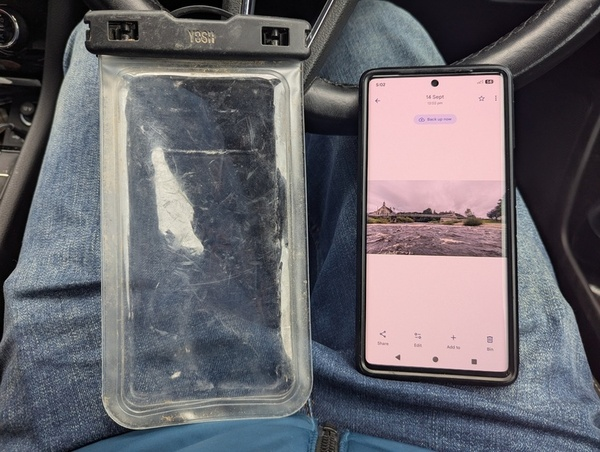
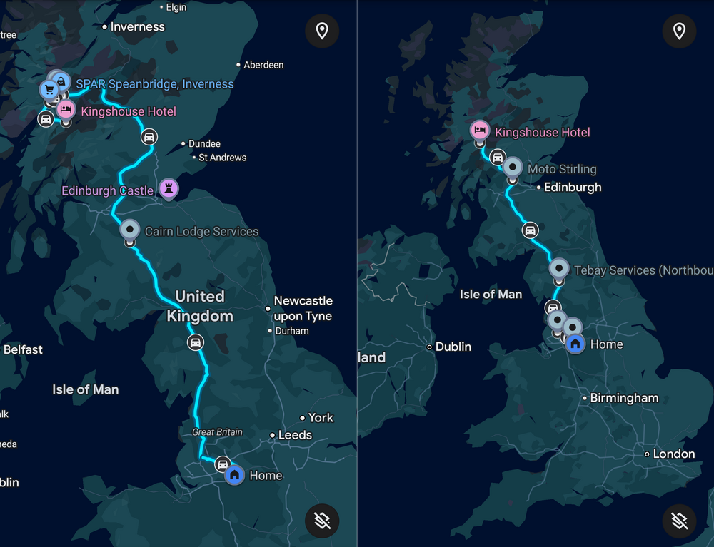
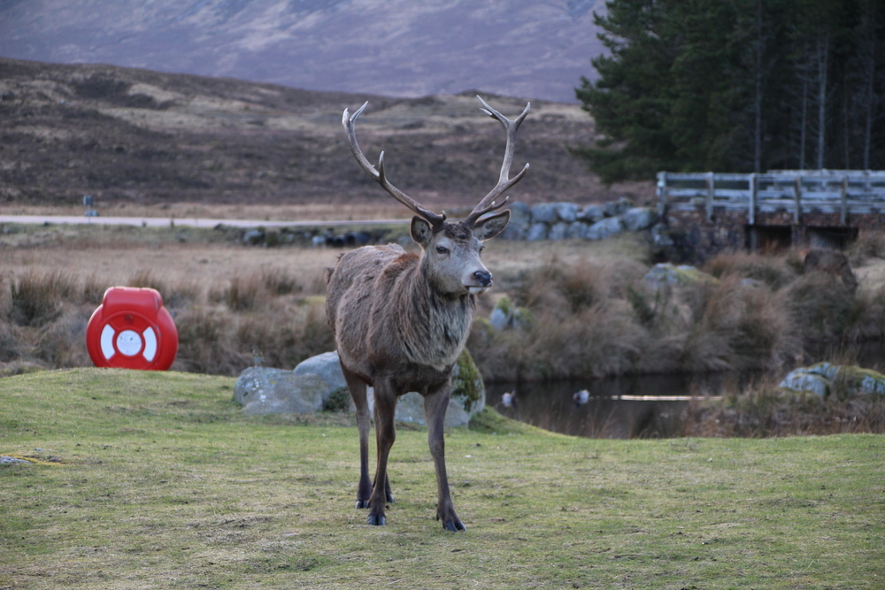
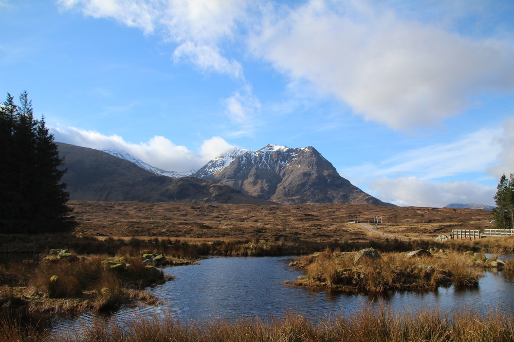
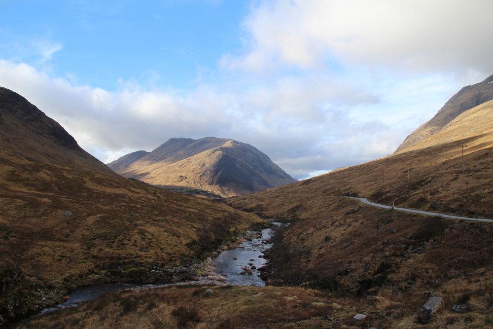
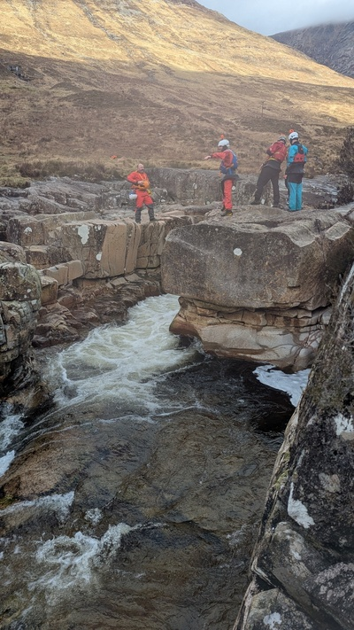
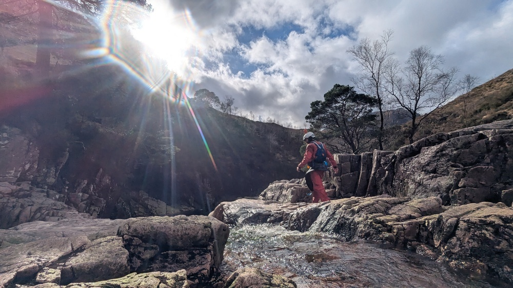
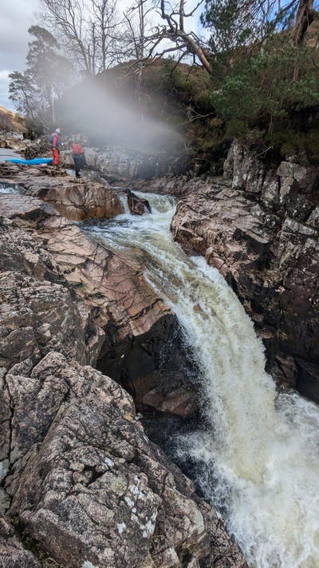
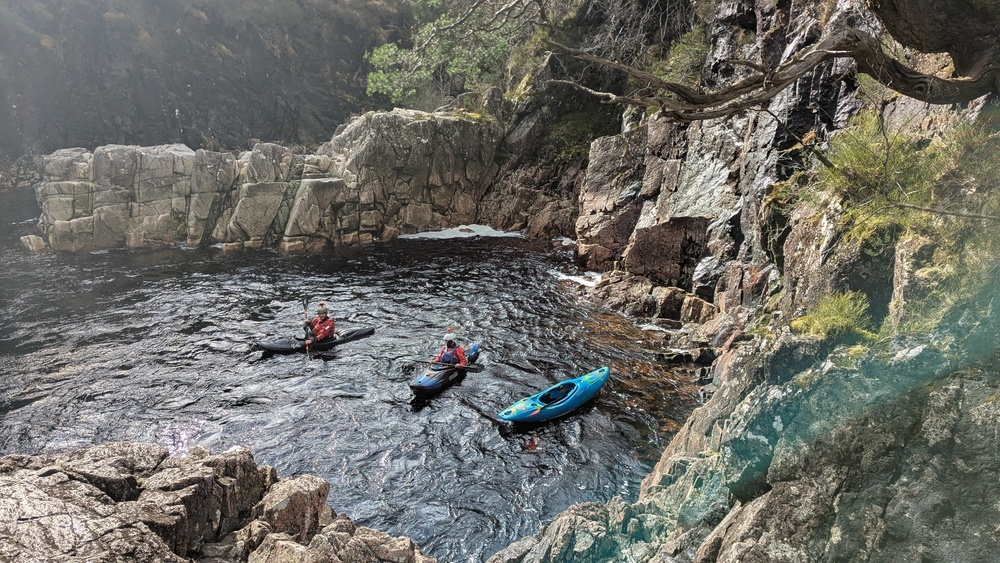
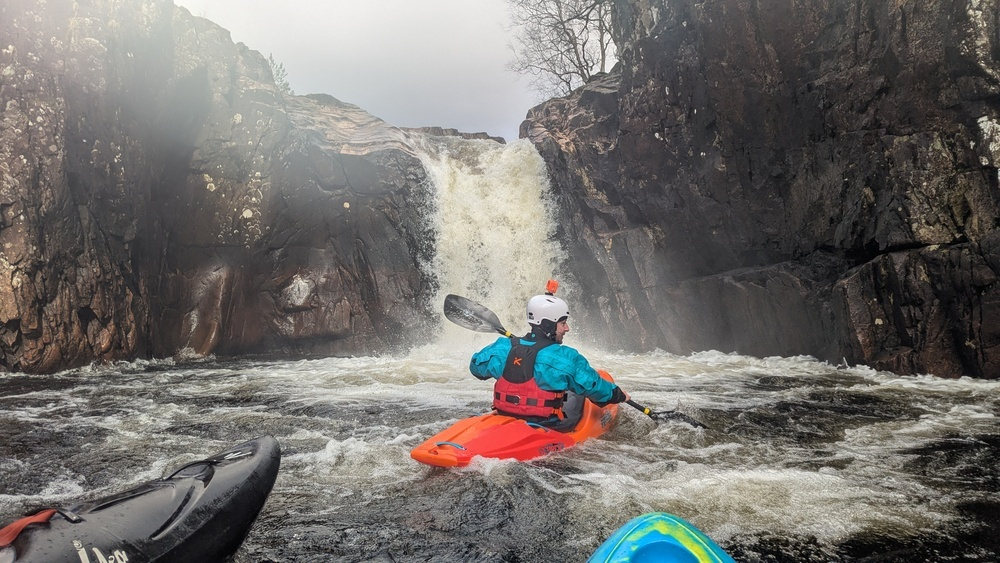

I realised I hadn't blogged anything outdoorsy for an awfully long time. I used to occasionally post
about [travels](/blog/tags/travel) and [adventures](/blog/tags/adventure), or my
[kayaking](/blog/tags/kayaking) in general, but I guess I haven't done anything blogworthy in a
while.

I've been kayaking (on-and-off) for over twenty years, mostly in the [Lake
District](/blog/tags/lake-district) and [North Wales](/blog/tags/wales), but also
[France](/blog/tags/france), [Austria](/blog/tags/austria), [Switzerland](/blog/tags/switzerland)
and the [USA](/blog/tags/usa).

I haven't paddled a lot in [Scotland](/blog/tags/scotland). Just the
[Nith](https://www.ukriversguidebook.co.uk/rivers/scotland/southern-uplands/river-nith-glen-airlie-picnic-site-to-drumlanrig-bridge/)
(a long time ago) and more recently the
[Esk](https://www.ukriversguidebook.co.uk/rivers/scotland/southern-uplands/river-esk-langholm-canonbie/),
both just over the Scottish border. I managed to drop my phone in the river on the Esk last year -
luckily and bizarrely it was found two weeks later by a fly fisherman who managed to access my
emergency contacts on the lock screen. I *just happened* to be in Scotland at the time, and arranged
to pick up my phone from him in Langholm on the way home, before I'd got around to replacing it.

<figure class="wp-block-image">

<figcaption>The found lost phone, with the last photo taken</figcaption>
</figure>

Big shout out to the maker of the [waterproof case](https://www.amazon.co.uk/dp/B06Y21DLWB?th=1)!

A bunch of us went for a weekend trip to the Scottish Highlands last month. We were especially
excited about doing the [River
Etive](https://www.ukriversguidebook.co.uk/rivers/scotland/west-highlands/river-etive-triple-falls-to-the-allt-achaorainn/)
in the stunningly beautiful [Glen Etive](https://en.wikipedia.org/wiki/Glen_Etive) near [Glen
Coe](https://en.wikipedia.org/wiki/Glen_Coe) in the Scottish Highlands. I've been wanting to do it
for many years but never had the chance. It's a river that's full of exciting drops with names like
"letterbox", "ski jump", "twist and shout", "crack of doom" and "crack of dawn". I've always been
envious of the amazing photos I've seen of people running what I now know is called "[right angle
falls](https://www.ukriversguidebook.co.uk/rivers/scotland/west-highlands/photos/river-etive-right-angle-falls)".

<figure class="wp-block-image">

<figcaption>It's a <em>really</em> long drive</figcaption>
</figure>

We arrived at the Kingshouse Hotel, where we were staying (in the bunkhouse next to the hotel), to
find a stag gracefully meandering the hotel car park:

<figure class="wp-block-image">

</figure>

In the morning we woke to this amazing view:

<figure class="wp-block-image">

<figcaption>The morning view from the Kingshouse Hotel</figcaption>
</figure>

We drove a few minutes to the river in the stunning Glen Etive:

<figure class="wp-block-image">

<figcaption>Glen Etive</figcaption>
</figure>

The river starts with three consecutive drops called "triple falls". A great way to warm up! Only
one of us in the group had paddled the Etive before, but Connah had read up on all the features, so
we stopped to scout everything to make sure we were prepared. Here's a video of me on triple
falls: [https://www.youtube.com/shorts/-pzJEMfXEcw](https://www.youtube.com/shorts/-pzJEMfXEcw)

<figure class="wp-block-image">

</figure>

<figure class="wp-block-image">
<iframe width="560" height="315" src="https://www.youtube.com/embed/9kbu1WdKYSE?si=MvJe6YGK9GWPQFen" title="YouTube video player" frameborder="0" allow="accelerometer; autoplay; clipboard-write; encrypted-media; gyroscope; picture-in-picture; web-share" referrerpolicy="strict-origin-when-cross-origin" allowfullscreen></iframe>
</figure>

<figure class="wp-block-image">

<figcaption>Connah</figcaption>
</figure>

Finally we arrived at "right angle falls". It's a 20-foot waterfall with a right angle immediately
before the drop, so you've got to make sure you don't capsize right above it!

<figure class="wp-block-image">

<figcaption>Right angle falls</figcaption>
</figure>

It looked extremely daunting — but the right angle is what worries you. You're expecting it to catch
you and send you down the fall backwards or upside-down, which is a little terrifying. Anyway, we
all successfully made our way down it without issue!

<figure class="wp-block-image">

<figcaption>Right after the falls</figcaption>
</figure>

Here's the video of me doing it:

<figure class="wp-block-image">
<iframe width="560" height="315" src="https://www.youtube.com/embed/dJTzqlFzBX0?si=Fci9diFSkeszhVt9" title="YouTube video player" frameborder="0" allow="accelerometer; autoplay; clipboard-write; encrypted-media; gyroscope; picture-in-picture; web-share" referrerpolicy="strict-origin-when-cross-origin" allowfullscreen></iframe>
</figure>

Another angle:

<figure class="wp-block-image">
<iframe width="560" height="315" src="https://www.youtube.com/embed/AO8FcjMtexI?si=bzsFUqN2YyQtbVFf" title="YouTube video player" frameborder="0" allow="accelerometer; autoplay; clipboard-write; encrypted-media; gyroscope; picture-in-picture; web-share" referrerpolicy="strict-origin-when-cross-origin" allowfullscreen></iframe>
</figure>

<figure class="wp-block-image">

<figcaption>Matt after we did right angle falls</figcaption>
</figure>

So far the trip had gone without incident. We went back to the start and did another run of triple
falls, and Kelvin managed to send himself down the middle drop backwards:
[https://www.youtube.com/shorts/JtmX0p4xmfc](https://www.youtube.com/shorts/JtmX0p4xmfc)

A great trip! I can't wait to go back.
