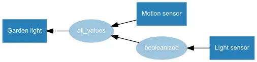
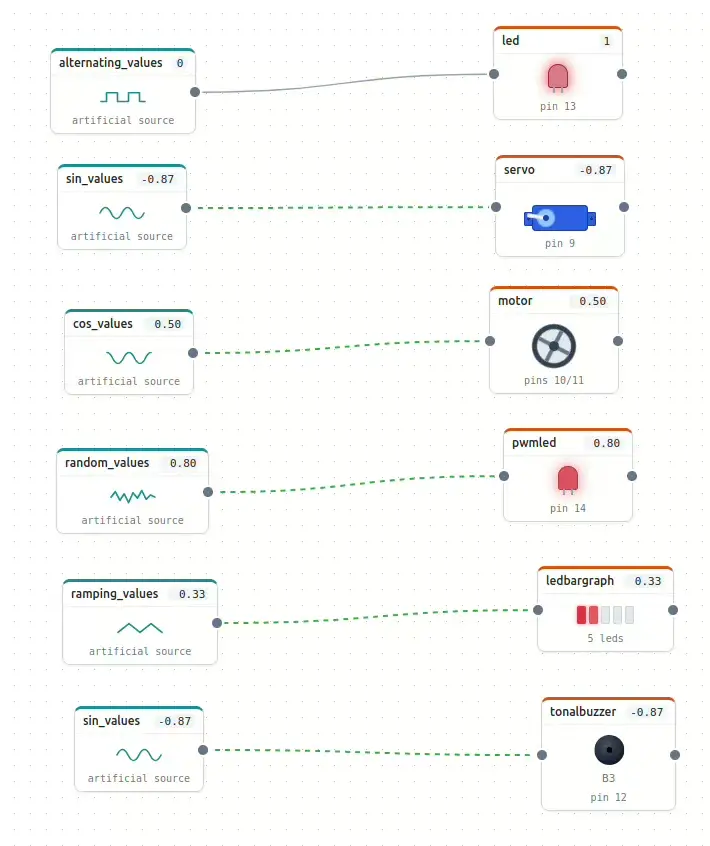
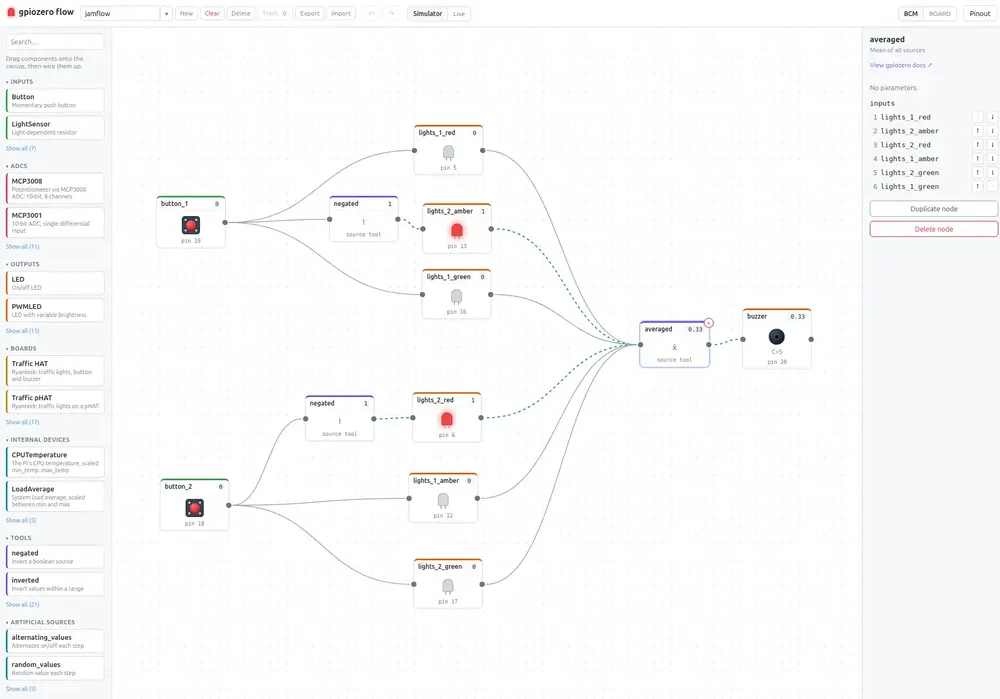
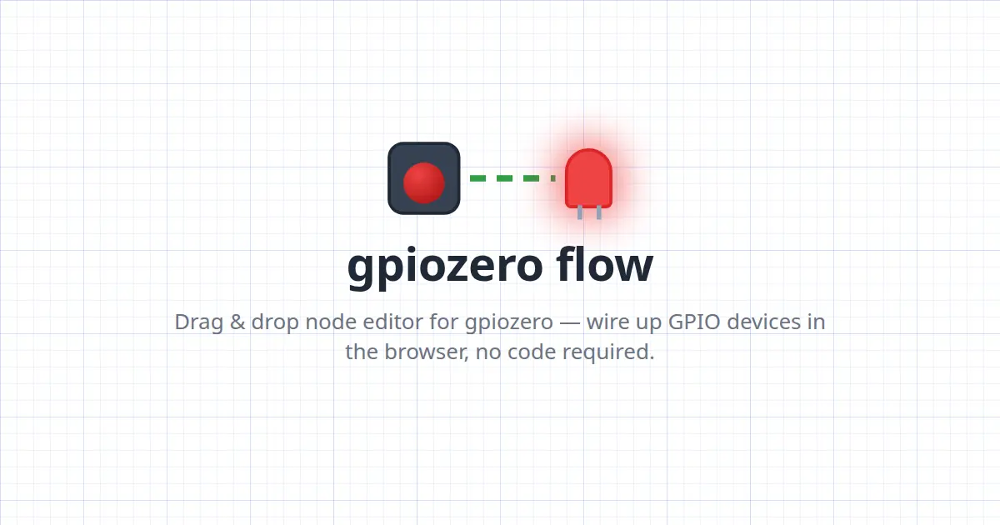

Back in 2015, I had the idea for [gpiozero](https://gpiozero.readthedocs.io/en/stable/) - a Python
library for Raspberry Pi, making programming GPIO devices simpler by abstraction: instead of
thinking about pin channels, voltages, pull-up resistors and rising or falling edges, we think about
buttons being pressed and released, sensors detecting light or motion, and motors driving forwards
and backwards. gpiozero let you write code in these terms.

We developed a device-focused API, and patterns emerged. We ended up supporting three types of
programming:

Procedural:

```python
while True:
    if button.is_pressed:
        led.on()
    else:
        led.off()
```

Event-based:

```python
button.when_pressed = led.on
button.when_released = led.off
```

Declarative:

```python
led.source = button
```

These three snippets achieve the same thing in different ways. One repeatedly **asks the button** if
it is pressed; one **tells the button** to control the LED; and one **tells the LED** to follow the
button's state.

It's hard to say which one is easier to read, write or understand. Maybe the last one as it's one
line. But if you wanted to reverse the logic, and make the button turn the LED off instead of on, it
would be trivial to work out how to change the first two, but not the third.

But that's where it gets interesting! We provide
[functions](https://gpiozero.readthedocs.io/en/stable/api_tools.html) for manipulating the stream of
values as it's passed from one device to another:

```python
led.source = negated(button)
```

and even for providing artificial value streams like a sine wave:

```
servo.source = sin_values()
```

This would drive the servo steadily from its minimum and maximum point.

The way all this works is by gpiozero assigning standard value ranges to devices. Some are simple
booleans, like the button and LED. The button is 1 when pressed, otherwise 0. The LED being 0 is
off, 1 is on. We can use PWM to control the LED, allowing it to have its brightness set on a scale
from 0 to 1. And if we take an analogue input that reads 0 to 1, we can directly control the LED's
brightness from that device:

```python
pot = MCP3008()
led = PWMLED(pin)

led.source = pot
```

Some devices go from -1 to 1, like a motor, where the 0 to 1 part is speed forwards, and the 0 to -1
part is speed backwards. So the sine wave would make it ramp up to full speed, slow down and reverse
direction and ramp up to full speed the other way.

You might want to manipulate or combine value streams - so we provide a collection of functions for
common use cases, like negated, inverted, clamped, scaled, absoluted, booleanized, zipped, and
smoothed. And you can write your own generator functions too.

I used to regularly include this concept in my many conference talks while working at Raspberry Pi,
and I wrote a [docs page](https://gpiozero.readthedocs.io/en/stable/source_values.html) explaining
the concept. This page showed how the relationship between devices could be expressed using simple
flow diagrams:

<figure class="wp-block-image">
<a href="https://gpiozero.readthedocs.io/en/stable/source_values.html"></a>
</figure>

<figure class="wp-block-image">
<a href="https://gpiozero.readthedocs.io/en/stable/source_values.html"></a>
</figure>

## gpiozero flow

This led to an idea - a web based UI where you could drag & drop GPIO devices from a side panel into
a freeform canvas, and draw lines between them to connect them. If you connected an LED to a button,
the button would control the LED, purely based on source/values.

There's a project called Node-RED that works this way, but I found it convoluted, and its GPIO
functionality was pin-based rather than device-focused. What I had in mind was purely based on how
gpiozero source/values worked.

I knew what I wanted but there were too many complexities to manage, and it required a lot of
knowledge of modern JavaScript. So here we are in 2026 and I have Claude to make light work of such
things.

I wrote a description of the idea, and a spec for the MVP - purely a simulator, and quickly had a
working prototype after agreeing some tech and design choices. I spent some time tweaking the UI,
adding configuration, icons and animations. It quickly became a fun tool to play around with:

<figure class="wp-block-image">

</figure>

We added a Python code generator so you could see the equivalent Python code for your project. We
then looked in to methods of remotely controlling a Pi's GPIO pins, and wrote an agent to run on the
Pi. The web app communicated to the Pi using websockets, and it *just worked*.

We added and refined more features and functionality - supporting pretty much every device in
gpiozero, including internal devices like `TimeOfDay`, the range of source tools for manipulating
value streams, and artificial sources such as `sin_values`:

<figure class="wp-block-image">

</figure>

I wanted to support add-on boards, but that didn't lend itself well to source/values because the
shape of a composite device made up of input and output components makes it hard to use. But it's
useful to be able to drag in a board you have and not have to assign all the specific pin numbers it
uses - so I included the boards but made them appear on the canvas as separate components,
pre-configured on the correct pins.

I thought it would be useful to be able to break up composite devices like traffic lights into their
component parts, and convert `LED`s into `PWMLED`s and back - so we added that. We added a limited
set of init params, added a link to the gpiozero docs for each class or function. I wanted to be
able to save multiple canvases - so we added localstorage support. From there we constructed
compressed JSON base64 encoding to allow the creation of shareable links, plus importing and
exporting in different ways.

<figure class="wp-block-image">

</figure>

While remote GPIO worked for me on localhost, Claude did point out that we would have issues if this
was hosted with SSL - because you can't make insecure websocket connections from an HTTPS origin,
and you can't use secure websockets because you can't get a certificate for a client over a LAN.

Initially we used a solution where we bundled the web app into a simple download and provided
instructions to run the app locally, but a suggestion from my friend Robie ended up making it
simpler. I published a Python package called
[gpiozero-flow](https://pypi.org/project/gpiozero-flow/) which includes both the websocket agent and
the web app itself. With this installed on the Pi, and both the web app and the agent running, the
hosted app at [flow.bennuttall.com](https://flow.bennuttall.com/) could allow you to hand over to
your Pi's app instance by entering its IP or hostname, taking your project with you, using the share
link. From there you can switch to Live mode which can then control your GPIOs directly.

So there we have it - an initial version of the project is live. Give it a try and see what you
think!

<figure class="wp-block-image">
<a href="https://flow.bennuttall.com/"></a>
</figure>

I'm not sure who might find it useful. In a way it's a simple graphical programming tool like
Scratch, Blockly or Edublocks. But you could argue that to do more than the basics requires more
advanced logic. Maybe it's a useful computational thinking tool rather than programming - maybe it
would suit the subject of [systems and
control](https://www.bbc.co.uk/bitesize/articles/z6q7b7h#z78dfdm) better than computing.

I *could* look at adding support for gpiozero's event-based paradigm, as I think this would work
well, but it might break the mental model of understanding values flowing between devices. There's
also the possibility of adding custom functions to use as generators, but again, I'd end up bolting
on a procedural programming tool.